# Laporan Modul 4: Konsep Dasar OOP

**Mata Kuliah:** Praktikum Pemrograman Berorientasi Objek   
**Nama:** Ikhsan Salsabily  
**NIM:** 2024573010102  
**Kelas:** TI 2E

---

## 1. Abstrak
Laporan ini merangkum hasil praktikum Modul 4 tentang Dasar Pemrograman Java.
Tujuannya adalah untuk memahami dan mengimplementasikan konsep-konsep dasar OOP seperti
Class, Object, Attribut, Method dan Constructor.
---

## 2. Praktikum

### Praktikum 2.1 - Konsep Dasar OOP

#### Dasar Teori
Objek-Oriented Programming (OOP) adalah paradigma pemrograman yang menggunakan “objek” - struktur data yang berisi data,
dalam bentuk field, sering kali dikenal sebagai atribut; dan kode, dalam bentuk prosedur, sering kali dikenal sebagai metode.

Inti dari OOP adalah mendesain software dengan membagi masalah menjadi serangkaian objek yang saling berinteraksi.
Ini bertentangan dengan pemrograman prosedural, yang fokus pada fungsi/prosedur dalam memproses data. OOP memungkinkan kita untuk membuat kode yang lebih modular, reusable, dan mudah di-maintain.

Konsep Dasar OOP:
1. Class: Template atau blueprint untuk membuat object
2. Object: Instance dari sebuah class
3. Attribute/Field: Variabel yang dimiliki oleh class
4. Method: Function yang dimiliki oleh class
5. Constructor: Method khusus untuk inisialisasi object

Prinsip OOP:
1. Encapsulation: Menyembunyikan detail implementasi
2. Inheritance: Pewarisan sifat dari class parent
3. Polymorphism: Kemampuan object untuk memiliki banyak bentuk
4. Abstraction: Menyederhanakan kompleksitas dengan menyembunyikan detail

Class dan Objek
kelas adalah konsep abstrak yang mendefinisikan set atribut dan metode yang akan dimiliki oleh object. 
Kelas menyediakan struktur atau template yang menentukan bagaimana sebuah object harus dibuat. 
Kelas akan menentukan jenis atribut dan metode apa yang akan dimiliki oleh object, tetapi tidak menentukan nilai dari atribut itu sendiri untuk object tertentu.

Object adalah inti dari pemrograman berorientasi objek. Setiap object memiliki dua karakteristik utama, yaitu:

Object, dalam konteks pemrograman OOP, adalah sebuah entitas yang memiliki karakteristik dan perilaku. Kelas, di sisi lain,
merupakan blueprint atau cetakan untuk membuat object. Kalau kamu bandingkan dengan dunia nyata, kamu bisa menganggap kelas sebagai rencana desain bangunan,
sedangkan object adalah bangunan yang sesungguhnya telah dibangun berdasarkan desain tersebut.

#### Langkah Praktikum

1.Buat package baru bernama modul_4 di dalam folder src.

2.Buat file Mahasiswa.java, MataKuliah.java, RencanaKartuStudi.java dan Main.java di dalam package tersebut.

3.Ketik dan jalankan kode untuk mendemonstrasikan variabel dan tipe data.


### Code program dan outputnya

Class Mahasiswa
```java
package modul_4;

public class Mahasiswa {
    //Atibut/Field(private untuk encapsulation)
    private String nama;
    private String nim;
    private String jurusan;

    //Constructor denga parameter
    public Mahasiswa(String nama, String nim, String jurusan, double ipk) {
        this.nama = nama;
        this.nim = nim;
        this.jurusan = jurusan;
    }
    // get methods
    public String getNama(){
        return nama;
        }
    public String getNim() {
        return nim;
    }
    public String getJurusan() {
        return jurusan;
    }
}
```
Class MataKuliah
```java
package modul_4;

import java.lang.runtime.SwitchBootstraps;

public class MataKuliah {
    private String kode;
    private String nama;
    private int sks;
    private double nilai;

    //constructor
    public MataKuliah(String kode, String nama, int sks) {
        this.kode = kode;
        this.nama = nama;
        this.sks = sks;
        this.nilai = 0.0;
    }

    public String getKode() {
        return kode;
    }
    public String getNama() {
        return nama;
    }
    public int getSks() {
        return sks;
    }
    public double getNilai() {
        return nilai;
    }
    public void setNilai(double nilai) {
        if (nilai >= 0.0 && nilai <= 100.0) {
            this.nilai = nilai;
        } else  {
            System.out.println("Nilai yang diiputka harus diantara 0-100");
        }
    }

    // konversi nilai angka ke huruf
    public String getNilaiHuruf() {
        if (nilai >= 85) return "A";
        else if (nilai >= 80) return "A-";
        else if (nilai >= 75) return "B+";
        else if (nilai >= 70) return "B";
        else if (nilai >= 65) return "B-";
        else if (nilai >= 60) return "C+";
        else if (nilai >= 55) return "C";
        else if (nilai >= 50) return "D";
        else return "E";
    }
    //Konversi nilai huruf ke bobot
    public double getBobotNilai(){
        String huruf = getNilaiHuruf();
        switch (huruf) {
            case "A":return 4.0;
            case "A-":return 3.7;
            case "B+":return 3.3;
            case "B":return 3.0;
            case "B-":return 2.7;
            case "C+":return 2.3;
            case "C":return 2.0;
            case "D":return 1.0;
            default:return 0.0;
        }
    }
    public void tampilkanInfo(){
        System.out.printf("%-10s %-30s %d SKS | Nilai: %.2f (%s)\n",
                kode, nama, sks, nilai, getNilaiHuruf());
    }
}

```
Class RencanaKartuStudi
```java
package modul_4;

    public class RencanaKartuStudi {
        private Mahasiswa mahasiswa;
        private MataKuliah[] daftarMatakuliah;
        private int jumlahMatkul;
        private int maxMatkul;

        public RencanaKartuStudi(Mahasiswa mahasiswa, int maxMatkul) {
            this.mahasiswa = mahasiswa;
            this.maxMatkul = maxMatkul;
            this.daftarMatakuliah = new MataKuliah[maxMatkul];
            this.jumlahMatkul = 0;
        }

        // Menambah mata kuliah ke KRS
        public boolean tambahMatakuliah(MataKuliah matkul) {
            if (jumlahMatkul < maxMatkul) {
                daftarMatakuliah[jumlahMatkul] = matkul;
                jumlahMatkul++;
                System.out.println("\nNote: Mata kuliah " + matkul.getNama() + " berhasil ditambahkan.");
                return true;
            } else {
                System.out.println("\nNote: KRS sudah penuh! Maksimal " + maxMatkul + " mata kuliah.");
                return false;
            }
        }

        // Menghitung total SKS
        public int hitungTotalSKS() {
            int totalSKS = 0;
            for (int i = 0; i < jumlahMatkul; i++) {
                totalSKS += daftarMatakuliah[i].getSks();
            }
            return totalSKS;
        }

        // Menghitung IPK
        public double hitungIPK() {
            if (jumlahMatkul == 0) return 0.0;
            double totalBobot = 0.0;
            int totalSKS = 0;

            for (int i = 0; i < jumlahMatkul; i++) {
                MataKuliah mk = daftarMatakuliah[i];
                totalBobot += mk.getBobotNilai() * mk.getSks();
                totalSKS += mk.getSks();
            }

            return totalSKS > 0 ? totalBobot / totalSKS : 0.0;
        }

        // Menampilkan KRS
        public void tampilkanKRS() {
            System.out.println("-------------------------------------------------------------");
            System.out.println("\t\t\tKARTU RENCANA STUDI (KRS)");
            System.out.println("-------------------------------------------------------------");
            System.out.println("Nama Mahasiswa\t: " + mahasiswa.getNama());
            System.out.println("NIM\t\t: " + mahasiswa.getNim());
            System.out.println("Jurusan\t\t: " + mahasiswa.getJurusan());
            System.out.println("-------------------------------------------------------------");
            System.out.println("NO\tMATA KULIAH\t\tSKS\tNILAI");
            System.out.println("-------------------------------------------------------------");

            if (jumlahMatkul > 0) {
                for (int i = 0; i < jumlahMatkul; i++) {
                    daftarMatakuliah[i].tampilkanInfo();
                }
            } else {
                System.out.println("Belum ada mata kuliah yang diambil.");
            }

            System.out.println("-------------------------------------------------------------");
            System.out.println("Total SKS\t\t\t: " + hitungTotalSKS());
            System.out.printf("IPK Semester\t\t: %.2f%n", hitungIPK());
            System.out.println("-------------------------------------------------------------\n");
        }

        // Mencari mata kuliah berdasarkan kode
        public MataKuliah cariMatakuliah(String kode) {
            for (int i = 0; i < jumlahMatkul; i++) {
                if (daftarMatakuliah[i].getKode().equalsIgnoreCase(kode)) {
                    return daftarMatakuliah[i];
                }
            }
            return null;
        }
    }

```
Class Main
```java
package modul_4;

import java.util.Scanner;

public class Main {
    public static void main(String[] args) {
        Scanner input = new Scanner(System.in);

        System.out.println("-------------------------------------------------------------");
        System.out.println("\t\tSISTEM KARTU RENCANA STUDI (KRS)");
        System.out.println("-------------------------------------------------------------");

        // Input data mahasiswa
        System.out.print("Nama Mahasiswa: ");
        String nama = input.nextLine();

        System.out.print("NIM: ");
        String nim = input.nextLine();

        System.out.print("Jurusan: ");
        String jurusan = input.nextLine();

        // Membuat object mahasiswa
        Mahasiswa mhs = new Mahasiswa(nama, nim, jurusan, 0.0);

        // Membuat object KRS (maksimal 10 mata kuliah)
        RencanaKartuStudi krs = new RencanaKartuStudi(mhs, 10);

        // Menu KRS
        boolean running = true;
        while (running) {
            System.out.println("\n-------------------------------------------------------------");
            System.out.println("\t\t\tMENU KRS");
            System.out.println("-------------------------------------------------------------");
            System.out.println("1. Tambah Mata Kuliah");
            System.out.println("2. Input Nilai Mata Kuliah");
            System.out.println("3. Tampilkan KRS");
            System.out.println("4. Keluar");
            System.out.print("Pilihan: ");
            int pilihan = input.nextInt();
            input.nextLine(); // consume newline

            switch (pilihan) {
                case 1:
                    System.out.println("\nTAMBAH MATA KULIAH");
                    System.out.print("Kode Mata Kuliah: ");
                    String kode = input.nextLine();
                    System.out.print("Nama Mata Kuliah: ");
                    String namaMK = input.nextLine();
                    System.out.print("Jumlah SKS: ");
                    int sks = input.nextInt();
                    input.nextLine();

                    MataKuliah mk = new MataKuliah(kode, namaMK, sks);
                    krs.tambahMatakuliah(mk);
                    break;

                case 2:
                    System.out.println("\nINPUT NILAI");
                    System.out.print("Kode Mata Kuliah: ");
                    String kodeCari = input.nextLine();

                    MataKuliah mkaCari = krs.cariMatakuliah(kodeCari);
                    if (mkaCari != null) {
                        System.out.print("Nilai (0–100): ");
                        double nilai = input.nextDouble();
                        input.nextLine();
                        mkaCari.setNilai(nilai);
                        System.out.println("Nilai berhasil diinput!");
                    } else {
                        System.out.println("Mata kuliah tidak ditemukan!");
                    }
                    break;

                case 3:
                    krs.tampilkanKRS();
                    break;

                case 4:
                    System.out.println("Terima kasih!");
                    running = false;
                    break;

                default:
                    System.out.println("Pilihan tidak valid!");
            }
        }
    }
}


```
Output Program:
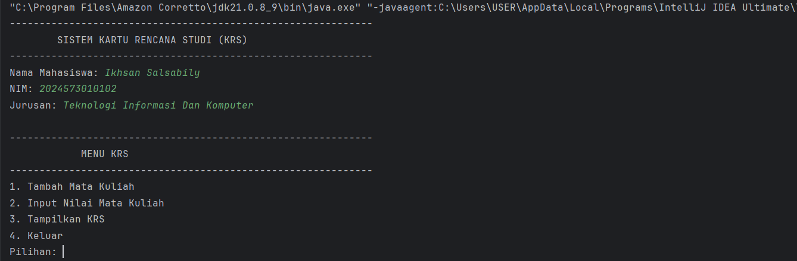
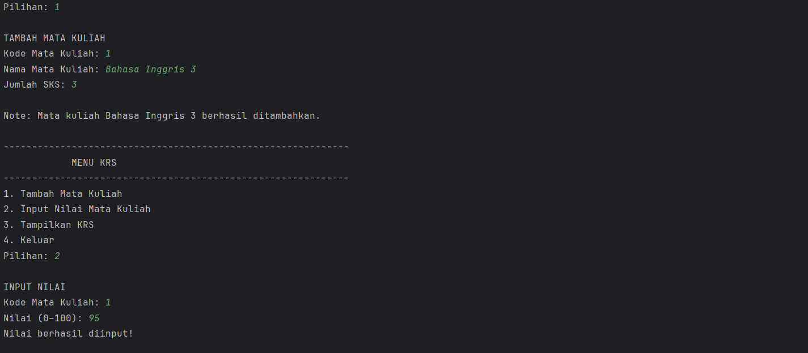
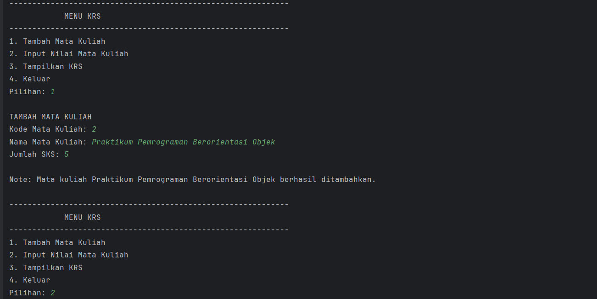
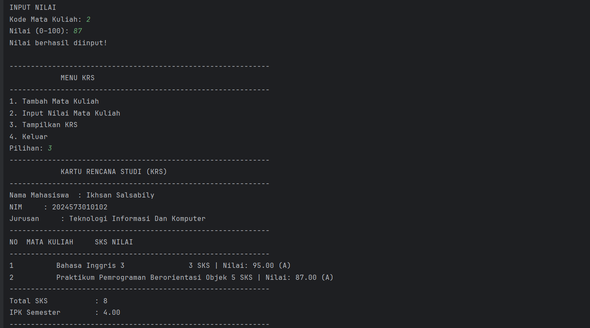
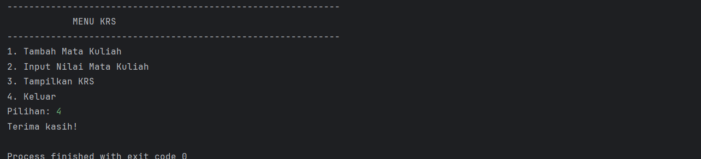

#### Analisa dan Pembahasan
Pada percobaan program ini kita membuat beberapa class yang didalamnya terdapat atribut untuk melengkapi class,
ketika class telah selesai dibuat kita bisa memanggil semua class pada main.java. ketika program dijalankan 
pengguna dapat mengisi dan memilih opsi yang akan digunakan.

### Tugas
1. Tambahkan fitur untuk menghapus mata kuliah dari KRS
2. Buat validasi agar total SKS tidak melebihi batas tertentu (misalnya 24 SKS)
3. Tambahkan method untuk menampilkan mata kuliah dengan nilai terbaik dan terburuk

### Code Program dan Outputnya
Class Mahasiswa
```java
package modul_4;

import java.lang.runtime.SwitchBootstraps;

public class MataKuliah {
    private String kode;
    private String nama;
    private int sks;
    private double nilai;

    //constructor
    public MataKuliah(String kode, String nama, int sks) {
        this.kode = kode;
        this.nama = nama;
        this.sks = sks;
        this.nilai = 0.0;
    }

    public String getKode() {
        return kode;
    }
    public String getNama() {
        return nama;
    }
    public int getSks() {
        return sks;
    }
    public double getNilai() {
        return nilai;
    }
    public void setNilai(double nilai) {
        if (nilai >= 0.0 && nilai <= 100.0) {
            this.nilai = nilai;
        } else  {
            System.out.println("Nilai yang diiputkan harus diantara 0-100");
        }
    }

    // konversi nilai angka ke huruf
    public String getNilaiHuruf() {
        if (nilai >= 85) return "A";
        else if (nilai >= 80) return "A-";
        else if (nilai >= 75) return "B+";
        else if (nilai >= 70) return "B";
        else if (nilai >= 65) return "B-";
        else if (nilai >= 60) return "C+";
        else if (nilai >= 55) return "C";
        else if (nilai >= 50) return "D";
        else return "E";
    }
    //Konversi nilai huruf ke bobot
    public double getBobotNilai(){
        String huruf = getNilaiHuruf();
        switch (huruf) {
            case "A":return 4.0;
            case "A-":return 3.7;
            case "B+":return 3.3;
            case "B":return 3.0;
            case "B-":return 2.7;
            case "C+":return 2.3;
            case "C":return 2.0;
            case "D":return 1.0;
            default:return 0.0;
        }
    }
    public void tampilkanInfo(){
        System.out.printf("%-10s %-30s %d SKS | Nilai: %.2f (%s)\n",
                kode, nama, sks, nilai, getNilaiHuruf());
    }
}
```
Class MataKuliah
```java
package modul_4;

import java.lang.runtime.SwitchBootstraps;

public class MataKuliah {
    private String kode;
    private String nama;
    private int sks;
    private double nilai;

    //constructor
    public MataKuliah(String kode, String nama, int sks) {
        this.kode = kode;
        this.nama = nama;
        this.sks = sks;
        this.nilai = 0.0;
    }

    public String getKode() {
        return kode;
    }
    public String getNama() {
        return nama;
    }
    public int getSks() {
        return sks;
    }
    public double getNilai() {
        return nilai;
    }
    public void setNilai(double nilai) {
        if (nilai >= 0.0 && nilai <= 100.0) {
            this.nilai = nilai;
        } else  {
            System.out.println("Nilai yang diiputkan harus diantara 0-100");
        }
    }

    // konversi nilai angka ke huruf
    public String getNilaiHuruf() {
        if (nilai >= 85) return "A";
        else if (nilai >= 80) return "A-";
        else if (nilai >= 75) return "B+";
        else if (nilai >= 70) return "B";
        else if (nilai >= 65) return "B-";
        else if (nilai >= 60) return "C+";
        else if (nilai >= 55) return "C";
        else if (nilai >= 50) return "D";
        else return "E";
    }
    //Konversi nilai huruf ke bobot
    public double getBobotNilai(){
        String huruf = getNilaiHuruf();
        switch (huruf) {
            case "A":return 4.0;
            case "A-":return 3.7;
            case "B+":return 3.3;
            case "B":return 3.0;
            case "B-":return 2.7;
            case "C+":return 2.3;
            case "C":return 2.0;
            case "D":return 1.0;
            default:return 0.0;
        }
    }
    public void tampilkanInfo(){
        System.out.printf("%-10s %-30s %d SKS | Nilai: %.2f (%s)\n",
                kode, nama, sks, nilai, getNilaiHuruf());
    }
}
```
Class RencanaKartuStudi
```java
package modul_4;

public class RencanaKartuStudi {
    private Mahasiswa mahasiswa;
    private MataKuliah[] daftarMatakuliah;
    private int jumlahMatkul;
    private int maxMatkul;

    // Batas total SKS (misalnya 24)
    private final int BATAS_SKS = 24;

    public RencanaKartuStudi(Mahasiswa mahasiswa, int maxMatkul) {
        this.mahasiswa = mahasiswa;
        this.maxMatkul = maxMatkul;
        this.daftarMatakuliah = new MataKuliah[maxMatkul];
        this.jumlahMatkul = 0;
    }

    // Menambah mata kuliah ke KRS dengan validasi SKS
    public boolean tambahMatakuliah(MataKuliah matkul) {
        int totalSksBaru = hitungTotalSKS() + matkul.getSks();
        if (totalSksBaru > BATAS_SKS) {
            System.out.println("\nNote: Total SKS melebihi batas (" + BATAS_SKS + " SKS)! Tidak bisa menambah mata kuliah.");
            return false;
        }

        if (jumlahMatkul < maxMatkul) {
            daftarMatakuliah[jumlahMatkul] = matkul;
            jumlahMatkul++;
            System.out.println("\nNote: Mata kuliah " + matkul.getNama() + " berhasil ditambahkan.");
            return true;
        } else {
            System.out.println("\nNote: KRS sudah penuh! Maksimal " + maxMatkul + " mata kuliah.");
            return false;
        }
    }

    // Menghapus mata kuliah berdasarkan kode
    public boolean hapusMatakuliah(String kode) {
        for (int i = 0; i < jumlahMatkul; i++) {
            if (daftarMatakuliah[i].getKode().equalsIgnoreCase(kode)) {
                System.out.println("\nNote: Mata kuliah " + daftarMatakuliah[i].getNama() + " telah dihapus.");
                // Geser elemen setelahnya
                for (int j = i; j < jumlahMatkul - 1; j++) {
                    daftarMatakuliah[j] = daftarMatakuliah[j + 1];
                }
                daftarMatakuliah[jumlahMatkul - 1] = null;
                jumlahMatkul--;
                return true;
            }
        }
        System.out.println("\nNote: Mata kuliah dengan kode " + kode + " tidak ditemukan.");
        return false;
    }

    // Menghitung total SKS
    public int hitungTotalSKS() {
        int totalSKS = 0;
        for (int i = 0; i < jumlahMatkul; i++) {
            totalSKS += daftarMatakuliah[i].getSks();
        }
        return totalSKS;
    }

    // Menghitung IPK
    public double hitungIPK() {
        if (jumlahMatkul == 0) return 0.0;
        double totalBobot = 0.0;
        int totalSKS = 0;

        for (int i = 0; i < jumlahMatkul; i++) {
            MataKuliah mk = daftarMatakuliah[i];
            totalBobot += mk.getBobotNilai() * mk.getSks();
            totalSKS += mk.getSks();
        }

        return totalSKS > 0 ? totalBobot / totalSKS : 0.0;
    }

    // Menampilkan KRS
    public void tampilkanKRS() {
        System.out.println("-------------------------------------------------------------");
        System.out.println("\t\t\tKARTU RENCANA STUDI (KRS)");
        System.out.println("-------------------------------------------------------------");
        System.out.println("Nama Mahasiswa\t: " + mahasiswa.getNama());
        System.out.println("NIM\t\t: " + mahasiswa.getNim());
        System.out.println("Jurusan\t\t: " + mahasiswa.getJurusan());
        System.out.println("-------------------------------------------------------------");
        System.out.println("NO\tMATA KULIAH\t\tSKS\tNILAI\n");
        System.out.println("-------------------------------------------------------------");

        if (jumlahMatkul > 0) {
            for (int i = 0; i < jumlahMatkul; i++) {
                daftarMatakuliah[i].tampilkanInfo();
            }
        } else {
            System.out.println("Belum ada mata kuliah yang diambil.");
        }

        System.out.println("-------------------------------------------------------------");
        System.out.println("Total SKS\t\t\t: " + hitungTotalSKS());
        System.out.printf("IPK Semester\t\t: %.2f%n", hitungIPK());
        System.out.println("-------------------------------------------------------------\n");
    }

    // Menampilkan mata kuliah dengan nilai terbaik dan terburuk
    public void tampilkanMatkulTerbaikDanTerburuk() {
        if (jumlahMatkul == 0) {
            System.out.println("Belum ada data mata kuliah!");
            return;
        }

        MataKuliah terbaik = daftarMatakuliah[0];
        MataKuliah terburuk = daftarMatakuliah[0];

        for (int i = 1; i < jumlahMatkul; i++) {
            if (daftarMatakuliah[i].getNilai() > terbaik.getNilai()) {
                terbaik = daftarMatakuliah[i];
            }
            if (daftarMatakuliah[i].getNilai() < terburuk.getNilai()) {
                terburuk = daftarMatakuliah[i];
            }
        }

        System.out.println("\n--- Mata Kuliah Terbaik ---");
        System.out.println("Nama: " + terbaik.getNama() + " | Nilai: " + terbaik.getNilai());
        System.out.println("--- Mata Kuliah Terburuk ---");
        System.out.println("Nama: " + terburuk.getNama() + " | Nilai: " + terburuk.getNilai());
    }

    // Mencari mata kuliah berdasarkan kode
    public MataKuliah cariMatakuliah(String kode) {
        for (int i = 0; i < jumlahMatkul; i++) {
            if (daftarMatakuliah[i].getKode().equalsIgnoreCase(kode)) {
                return daftarMatakuliah[i];
            }
        }
        return null;
    }
}
```
Class Main
```java
package modul_4;
import java.util.Scanner;

public class Main {
    public static void main(String[] args) {
        Scanner input = new Scanner(System.in);

        System.out.println("-------------------------------------------------------------");
        System.out.println("\t\tSISTEM KARTU RENCANA STUDI (KRS)");
        System.out.println("-------------------------------------------------------------");

        // Input data mahasiswa
        System.out.print("Nama Mahasiswa: ");
        String nama = input.nextLine();

        System.out.print("NIM: ");
        String nim = input.nextLine();

        System.out.print("Jurusan: ");
        String jurusan = input.nextLine();

        // Membuat object mahasiswa
        Mahasiswa mhs = new Mahasiswa(nama, nim, jurusan, 0.0);

        // Membuat object KRS (maksimal 10 mata kuliah)
        RencanaKartuStudi krs = new RencanaKartuStudi(mhs, 10);

        // Menu KRS
        boolean running = true;
        while (running) {
            System.out.println("\n-------------------------------------------------------------");
            System.out.println("\t\t\tMENU KRS");
            System.out.println("-------------------------------------------------------------");
            System.out.println("1. Tambah Mata Kuliah");
            System.out.println("2. Input Nilai Mata Kuliah");
            System.out.println("3. Tampilkan KRS");
            System.out.println("4. Hapus Mata Kuliah");
            System.out.println("5. Tampilkan Mata Kuliah Terbaik & Terburuk");
            System.out.println("6. Keluar");
            System.out.print("Pilihan: ");
            int pilihan = input.nextInt();
            input.nextLine(); // consume newline

            switch (pilihan) {
                case 1:
                    System.out.println("\nTAMBAH MATA KULIAH");
                    System.out.print("Kode Mata Kuliah: ");
                    String kode = input.nextLine();
                    System.out.print("Nama Mata Kuliah: ");
                    String namaMK = input.nextLine();
                    System.out.print("Jumlah SKS: ");
                    int sks = input.nextInt();
                    input.nextLine();

                    MataKuliah mk = new MataKuliah(kode, namaMK, sks);
                    krs.tambahMatakuliah(mk);
                    break;

                case 2:
                    System.out.println("\nINPUT NILAI");
                    System.out.print("Kode Mata Kuliah: ");
                    String kodeCari = input.nextLine();

                    MataKuliah mkaCari = krs.cariMatakuliah(kodeCari);
                    if (mkaCari != null) {
                        System.out.print("Nilai (0–100): ");
                        double nilai = input.nextDouble();
                        input.nextLine();
                        mkaCari.setNilai(nilai);
                        System.out.println("Nilai berhasil diinput!");
                    } else {
                        System.out.println("Mata kuliah tidak ditemukan!");
                    }
                    break;

                case 3:
                    krs.tampilkanKRS();
                    break;

                case 4:
                    System.out.println("\nHAPUS MATA KULIAH");
                    System.out.print("Masukkan Kode Mata Kuliah: ");
                    String kodeHapus = input.nextLine();
                    krs.hapusMatakuliah(kodeHapus);
                    break;

                case 5:
                    krs.tampilkanMatkulTerbaikDanTerburuk();
                    break;

                case 6:
                    System.out.println("Terima kasih telah menggunakan program ini !");
                    running = false;
                    break;

                default:
                    System.out.println("Pilihan tidak valid!");
            }
        }
        input.close();
    }
}
```

Program Output:
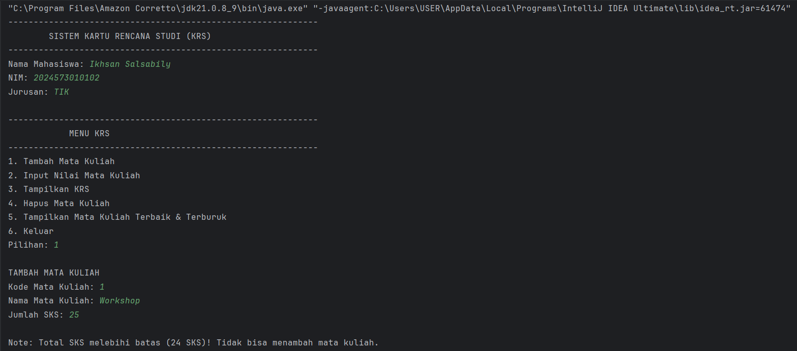
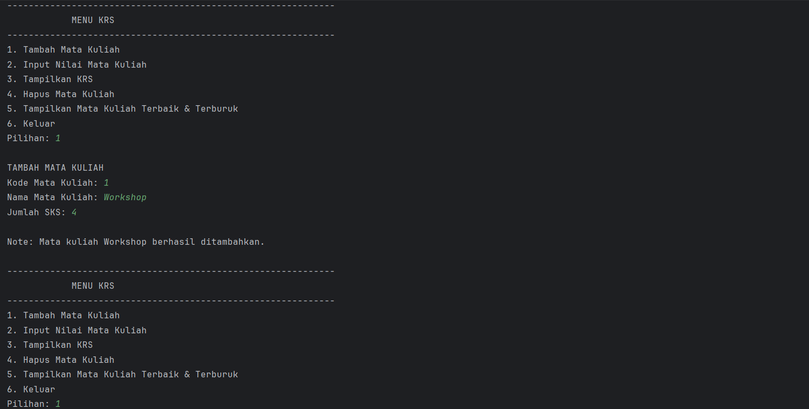
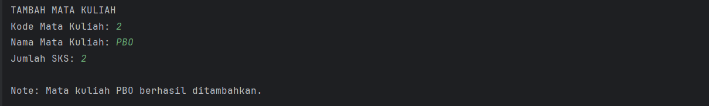
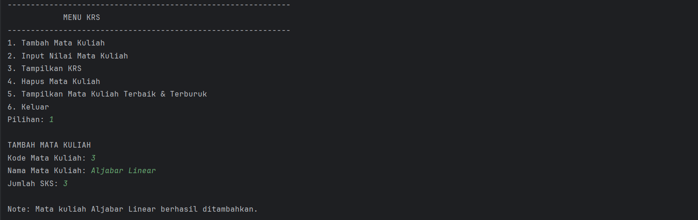
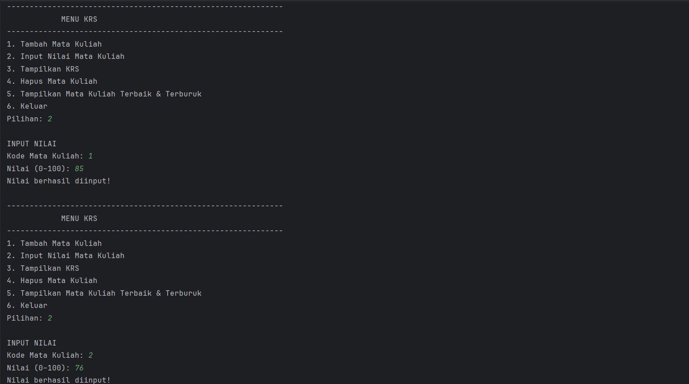
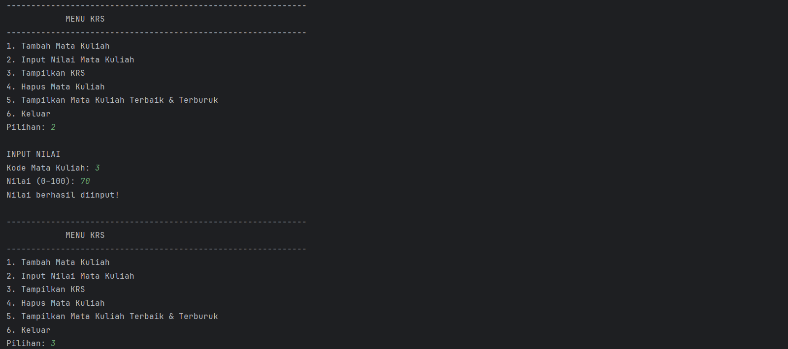
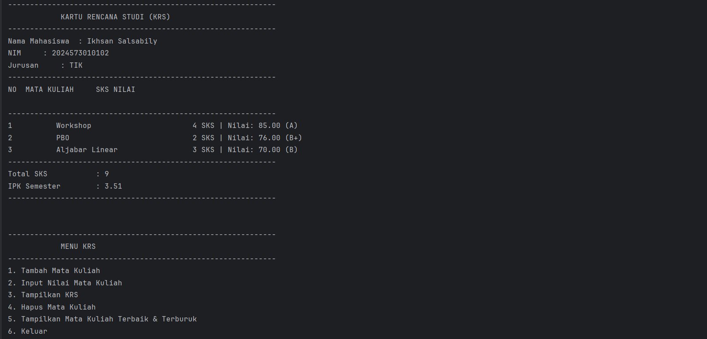
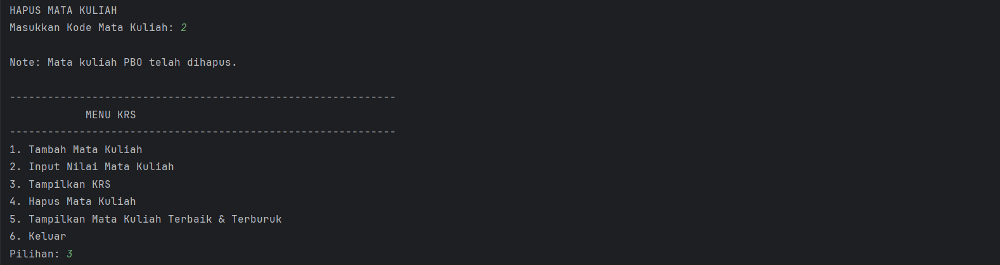
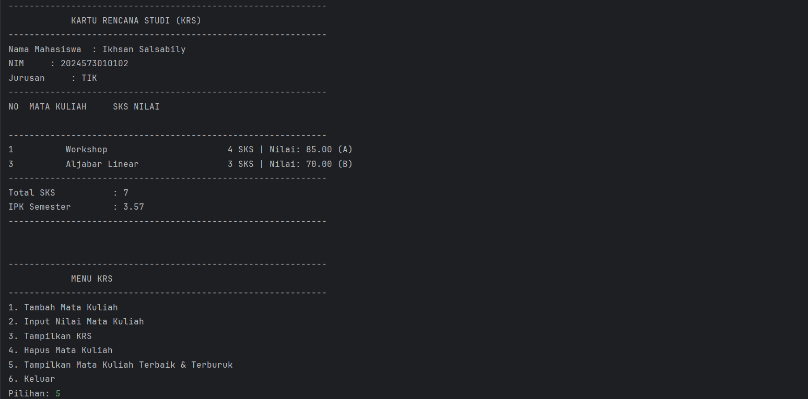
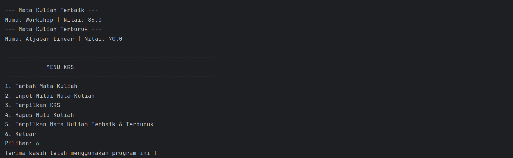

#### Analisa dan Pembahasan
Setelah dilakukan penambahan code program, sekarang pengguna dapat menghapus mata kuliah berdasarkan indek,
kemudian dapat melihat nilai terbaik dan terburuk dari mahasiswa yang dimasukkan, kemudian jumlah sks yang bisa dimasukkan
hanya sampai 24 sks, jika lebih dari itu program akan berhenti dan menampilkan pesan.

---

## 3. Kesimpulan

Praktikum ini memberikan pemahaman yang kuat tentang dasar-dasar OOP, bagaimana sebuah class dibuat dan kemudian class tersebut dijalankan
pada main.java, kemudian barulah pengguna bisa menggunakannya. constructor digunkaan untuk membuat sebuah fungsi yang dimana fungsi tersebut harus
diisikan dengan nilai.

---

## 5. Referensi

Java Tutorials - The Java™ Tutorials - https://docs.oracle.com/javase/tutorial/

Java Data Types - https://www.geeksforgeeks.org/java/java-data-types/

Java Control Flow Statements - https://dev.java/learn/language-basics/controlling-flow/

---
