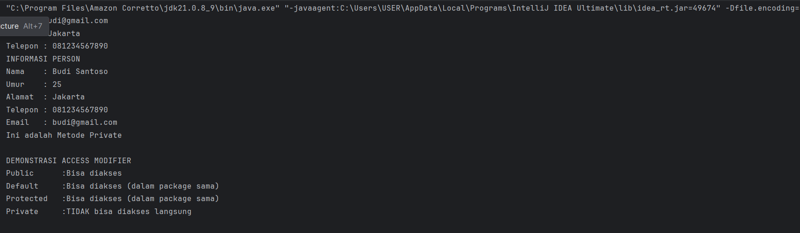
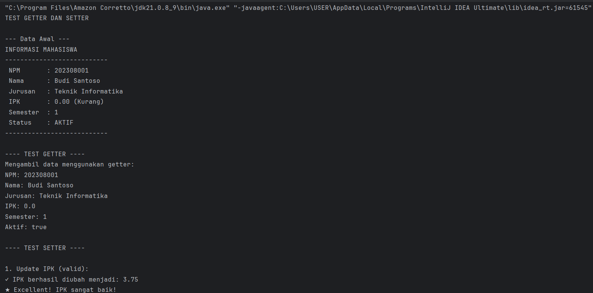
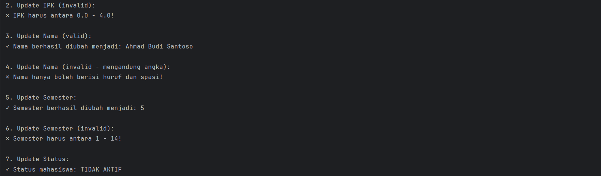
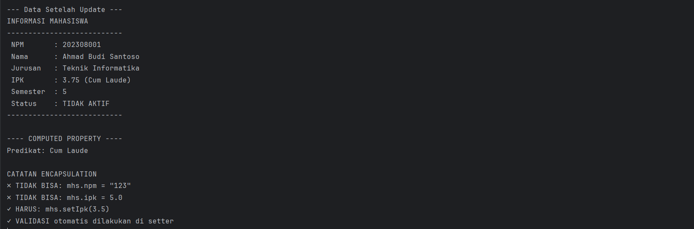
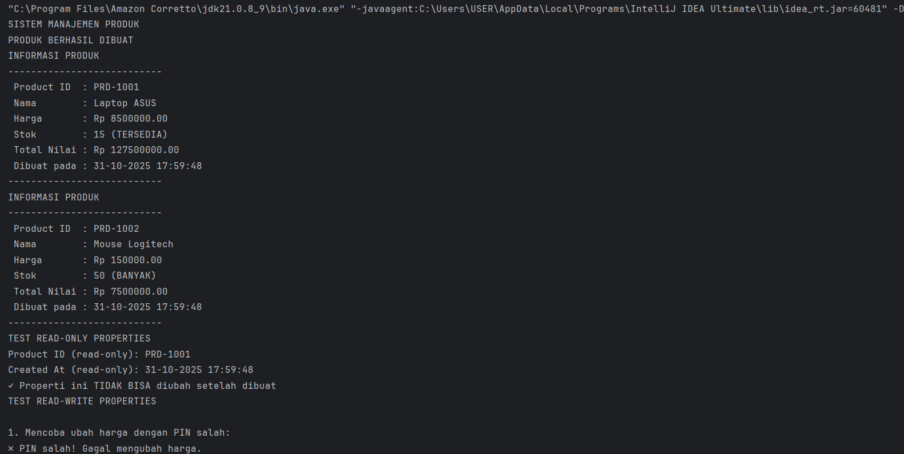
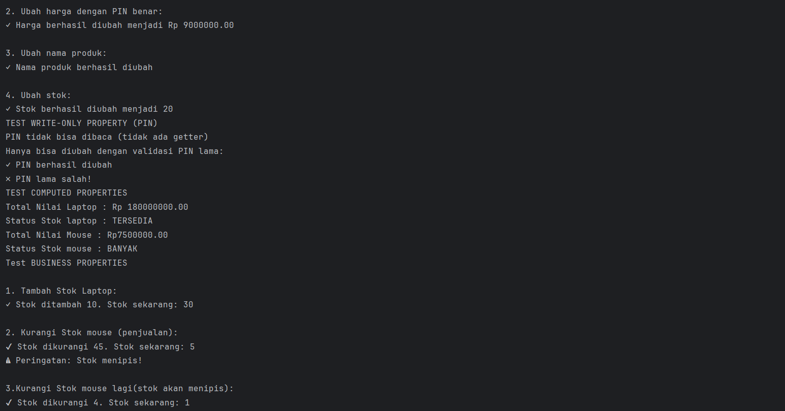
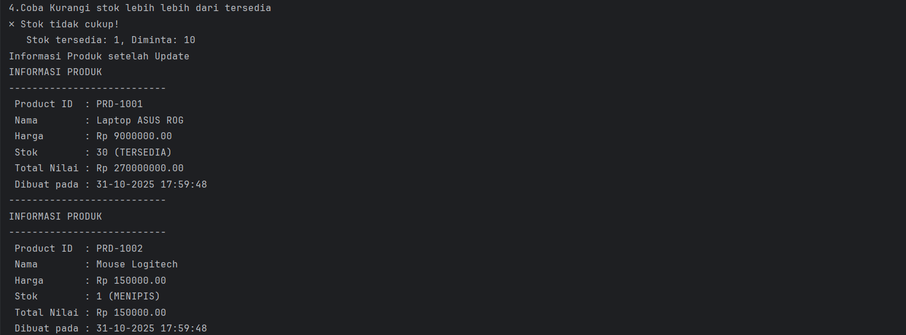
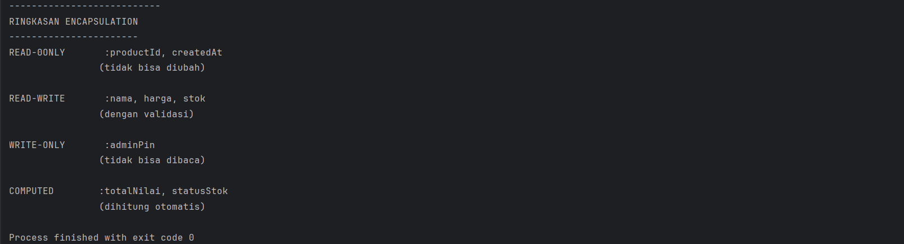

# Laporan Modul 5: Enkapsulasi 

**Mata Kuliah:** Praktikum Pemrograman Berorientasi Objek   
**Nama:** Ikhsan Salsabily  
**NIM:** 2024573010102  
**Kelas:** TI 2E

---

## 1. Abstrak

Laporan ini merangkum hasil praktikum Modul 2 tentang Dasar Pemrograman Java.
Tujuannya adalah untuk memahami dan mengimplementasikan konsep-konsep dasar seperti tipe data,
variabel, input/output, struktur kontrol percabangan (if-else dan switch),
serta perulangan (for, while, dan do-while) melalui studi kasus.

---

## 2. Pendahuluan

Encapsulation (Enkapsulasi) adalah salah satu prinsip fundamental dalam Object-Oriented Programming (OOP) yang membungkus data (attributes) dan method yang bekerja pada data tersebut dalam satu unit (class), serta menyembunyikan detail implementasi internal dari dunia luar.

Tujuan Encapsulation :
1. Data Protection - Melindungi data dari akses dan modifikasi yang tidak sah.
2. Data Validation - Memastikan data yang masuk valid sebelum disimpan.
3. Flexibility - Mudah mengubah implementasi internal tanpa mempengaruhi kode luar.
4. Maintainability - Kode lebih mudah dipelihara dan di-debug.
5. Modularity - Membuat kode lebih modular dan terorganisir

Cara Implementasi : 
1. Deklarasikan attributes sebagai private.
2. Buat getter methods untuk membaca nilai attributes.
3. Buat setter methods untuk mengubah nilai attributes dengan validasi.
4. Tambahkan business logic di dalam class.

---

## 3. Praktikum

### Praktikum 1 - Memahami Access Modifier

#### Dasar Teori

Access modifier menentukan tingkat akses terhadap class, attributes, dan methods. Java memiliki 4 jenis access modifier:
1. public
2. protected
3. default
4. private

#### Langkah Praktikum

1.Buat package baru bernama modul_5 di dalam folder src kemudian buat package baru didalamnya dengan nama pratikum_1.

2.Buat class baru dengan nama Person dengan berbagai access modifier, kemudian buat class AccessModifierTest untuk test.

3.Ketik dan jalankan kode kemudian amati hasilnya.

#### Code Program dan Screenshoot Hasil

1.Class Person
```java
package modul_5.praktikum_1;

public class Person {
    // private-hanya bisa diakses dalam class ini
    private String nama;
    private int umur;

    // default (package-private)- bisa diakses dalam package yang sama
    String alamat;

    //protected - bisa diakses dalam package dan subclass
    protected  String telepon;

    //public -bisa diakses dari mana saja
    public String email;

    //contructor
    public Person(String nama, int umur) {
        this.nama = nama;
        this.umur = umur;
    }
    public void tampilkanInfo(){
        System.out.println("INFORMASI PERSON");
        System.out.println("Nama    : " + nama);       // ok-dalam class yang sama
        System.out.println("Umur    : " + umur);       // ok-dalam class yang sama
        System.out.println("Alamat  : " + alamat);   // ok-dalam class yang sama
        System.out.println("Telepon : " + telepon); // ok-dalam class yang sama
        System.out.println("Email   : " + email);     // ok-dalam class yang sama
    }
    // Private method - hanya bisa dipanggil dalam class ini
    private void metodePribadi(){
        System.out.println("Ini adalah Metode Private");
    }
    //protected method
    protected void metodeProtected(){
        System.out.println("Ini adalah Metode Protected");
    }
    // method untuk mengakses private method
    protected void panggilMetodePribadi(){
        metodePribadi(); // ok - dala, class yang sama
    }
}

```

2.Class AccessModifierTest
```java
package modul_5.praktikum_1;

public class AccessModifierTest {
    public static void main(String[] args) {

        Person person = new Person("Budi Santoso", 25);

        // test akses public
        person.email = "budi@gmail.com"; // ok -public
        System.out.println("Email : " + person.email);

        // test akses protected (dalam package yang sama)
        person.alamat = "Jakarta"; // ok - dalam package yang sama
        System.out.println("Alamat : " + person.alamat);

        // test akses protected (dalam package yang sama)
        person.telepon = "081234567890";// ok -dalam package yang sama
        System.out.println("Telepon : " + person.telepon);

        // test akses private - AKAN ERROR jika Uncoment
        // person.nama = "Andi";        // Error - private
        //person.umur =   30;           // error - private
        //person.metodePribadi();       // error - private

        //mengakses data private melalui public method
        person.tampilkanInfo();

        //mengakses private method melalui public method
        person.panggilMetodePribadi();

        System.out.println("\nDEMONSTRASI ACCESS MODIFIER");
        System.out.println("Public      :Bisa diakses");
        System.out.println("Default     :Bisa diakses (dalam package sama)");
        System.out.println("Protected   :Bisa diakses (dalam package sama)");
        System.out.println("Private     :TIDAK bisa diakses langsung");


    }
}

```
Output :



#### Analisa dan Pembahasan

Pada program java kali ini kita mencoba membuat accesmodifier yang dimana didalamnya terdapat:
default dapat diacces dari mana saja selagi masih dalam folder project yang sama, private hanya bisa diakses dalam class yang sama
jika ingin memanggilnya didalam class yang berbeda kita harus membuat fungsi baru, protected bisa akses dalam package dan subclass yang sama,
dan public bisa diakses oleh class yang sama. kemudian jika comment yang terdapat pada class accesmodifiertest dihapus program akan mengalami error karena mengakses private secara langsung tanpa fungsi tambahan.

### Praktikum 2 - Getter dan Setter

#### Dasar Teori

Getter dan Setter adalah method yang digunakan untuk mengakses dan mengubah nilai private attributes.

Naming Convention:

1. Getter: get + NamaAttribute (contoh: getNama())
2. Setter: set + NamaAttribute (contoh: setNama())
3. Boolean Getter: is + NamaAttribute (contoh: isActive())

Keuntungan Menggunakan Getter/Setter:

1. Kontrol akses terhadap data
2. Validasi data sebelum disimpan
3. Read-only atau write-only attributes
4. Computed attributes
5. Lazy initialization

#### Langkah Praktikum

1.Buat package baru bernama modul_5 di dalam folder src kemudian buat package baru didalamnya dengan nama pratikum_2.

2.Buat class baru dengan nama Mahasiswa dengan getter dan setter lengkap, kemudian buat class GetterSetterTest untuk test.

3.Ketik dan jalankan kode kemudian amati hasilnya.

#### Code Program dan Screenshoot Hasil

1.Class Mahasiswa
```java
package modul_5.praktikum_2;

public class Mahasiswa {
    //private attributes
    private String nim;
    private String nama;
    private String jurusan;
    private double ipk;
    private int semester;
    private boolean aktif;

    //Constructor
    public Mahasiswa(String nim, String nama, String jurusan) {
        this.nim = nim;
        this.nama = nama;
        this.jurusan = jurusan;
        this.ipk = 0.0;
        this.semester = 1;
        this.aktif = true;
    }
    // Getter methods
    public String getNim() {
        return nim;
    }
    public String getNama() {
        return nama;
    }
    public String getJurusan() {
        return jurusan;
    }
    public double getIpk() {
        return ipk;
    }
    public int getSemester() {
        return semester;
    }
    //boolean getter menggunakan 'is'prefix
    public boolean isAktif() {
        return aktif;
    }
    // setter methofd dengan validasi

    //NiM: Read-only (tidak ada setter)
    //Alasan:Nim tidak boleh diubah setelah dibuat
    public void setNama(String nama) {
        // Validasi: Nama tidak boleh kosong
        if (nama == null || nama.trim().isEmpty()) {
            System.out.println("✗ Nama tidak boleh kosong!");
            return;
        }

        // Validasi: Nama hanya huruf dan spasi
        if (!nama.matches("[a-zA-Z ]+")) {
            System.out.println("✗ Nama hanya boleh berisi huruf dan spasi!");
            return;
        }

        this.nama = nama;
        System.out.println("✓ Nama berhasil diubah menjadi: " + nama);
    }

    public void setJurusan(String jurusan) {
        // Validasi: Jurusan tidak boleh kosong
        if (jurusan == null || jurusan.trim().isEmpty()) {
            System.out.println("✗ Jurusan tidak boleh kosong!");
            return;
        }

        this.jurusan = jurusan;
        System.out.println("✓ Jurusan berhasil diubah menjadi: " + jurusan);
    }

    public void setIpk(double ipk) {
        // Validasi: IPK antara 0.0 - 4.0
        if (ipk < 0.0 || ipk > 4.0) {
            System.out.println("✗ IPK harus antara 0.0 - 4.0!");
            return;
        }

        this.ipk = ipk;
        System.out.printf("✓ IPK berhasil diubah menjadi: %.2f%n", ipk);

        // Cek status akademik berdasarkan IPK
        cekStatusAkademik();
    }

    public void setSemester(int semester) {
        // Validasi: Semester antara 1 - 14
        if (semester < 1 || semester > 14) {
            System.out.println("✗ Semester harus antara 1 - 14!");
            return;
        }

        this.semester = semester;
        System.out.println("✓ Semester berhasil diubah menjadi: " + semester);
    }
    public void setAktif(boolean aktif) {
        this.aktif = aktif;
        String status = aktif ? "AKTIF" : "TIDAK AKTIF";
        System.out.println("✓ Status mahasiswa: " + status);
    }

    // HELPER METHODS (PRIVATE)
    private void cekStatusAkademik() {
        if (ipk < 2.0) {
            System.out.println("⚠ Peringatan: IPK di bawah standar!");
        } else if (ipk >= 3.5) {
            System.out.println("★ Excellent! IPK sangat baik!");
        }
    }

    // PUBLIC METHODS
    public String getPredikat() {
        if (ipk > 3.5) return "Cum Laude";
        else if (ipk > 3.0) return "Sangat Baik";
        else if (ipk > 2.5) return "Baik";
        else if (ipk > 2.0) return "Cukup";
        else return "Kurang";
    }

    public void tampilkanInfo() {
        System.out.println("INFORMASI MAHASISWA");
        System.out.println("---------------------------");
        System.out.println(" NPM       : " + nim);
        System.out.println(" Nama      : " + nama);
        System.out.println(" Jurusan   : " + jurusan);
        System.out.printf(" IPK       : %.2f (%s)%n", ipk, getPredikat());
        System.out.println(" Semester  : " + semester);
        System.out.println(" Status    : " + (aktif ? "AKTIF" : "TIDAK AKTIF"));
        System.out.println("---------------------------");
    }
}

```

2.Class GetterSetterTest
```java
package modul_5.praktikum_2;

public class GetterSetterTest {
        public static void main(String[] args) {
            System.out.println("TEST GETTER DAN SETTER\n");

            // Membuat object mahasiswa
            Mahasiswa mhs = new Mahasiswa("202308001", "Budi Santoso", "Teknik Informatika");

            System.out.println("--- Data Awal ---");
            mhs.tampilkanInfo();

            // Test GETTER
            System.out.println("\n---- TEST GETTER ----");
            System.out.println("Mengambil data menggunakan getter:");
            System.out.println("NPM: " + mhs.getNim());
            System.out.println("Nama: " + mhs.getNama());
            System.out.println("Jurusan: " + mhs.getJurusan());
            System.out.println("IPK: " + mhs.getIpk());
            System.out.println("Semester: " + mhs.getSemester());
            System.out.println("Aktif: " + mhs.isAktif());

            // Test SETTER dengan validasi
            System.out.println("\n---- TEST SETTER ----");

            // Test 1: Update IPK valid
            System.out.println("\n1. Update IPK (valid):");
            mhs.setIpk(3.75);

            // Test 2: Update IPK invalid
            System.out.println("\n2. Update IPK (invalid):");
            mhs.setIpk(5.0); // Akan ditolak

            // Test 3: Update nama valid
            System.out.println("\n3. Update Nama (valid):");
            mhs.setNama("Ahmad Budi Santoso");

            // Test 4: Update nama invalid
            System.out.println("\n4. Update Nama (invalid - mengandung angka):");
            mhs.setNama("Budi123"); // Akan ditolak

            // Test 5: Update semester valid
            System.out.println("\n5. Update Semester:");
            mhs.setSemester(5);

            // Test 6: Update semester invalid
            System.out.println("\n6. Update Semester (invalid):");
            mhs.setSemester(20); // Akan ditolak

            // Test 7: Update status
            System.out.println("\n7. Update Status:");
            mhs.setAktif(false);

            // Tampilkan data akhir
            System.out.println("\n--- Data Setelah Update ---");
            mhs.tampilkanInfo();

            // Demonstrasi computed property
            System.out.println("\n---- COMPUTED PROPERTY ----");
            System.out.println("Predikat: " + mhs.getPredikat());

            // Tidak bisa akses langsung (akan error)
            System.out.println("\nCATATAN ENCAPSULATION");
            System.out.println("✗ TIDAK BISA: mhs.npm = \"123\"");
            System.out.println("✗ TIDAK BISA: mhs.ipk = 5.0");
            System.out.println("✓ HARUS: mhs.setIpk(3.5)");
            System.out.println("✓ VALIDASI otomatis dilakukan di setter");
        }
}

```

Output:





#### Analisa dan Pembahasan

pada program ini kita membuat sebuah  kelas Mahasiswa melindungi data intinya (private attributes) dan memastikan hanya
bisa diakses melalui Getter dan Setter tervalidasi misalnya ipk yang dimasukan harus sesuai dengan yang telah ada dalam
class mahasiswa dan NIM hanya bisa dilihat saja , sementara class GetterSetterTest berfungsi sebagai penguji yang memverifikasi
bahwa setter berhasil memperbarui data valid dan secara tepat menolak data yang tidak valid.

### Praktikum 3 - Read-Only dan Write-Only Properties

#### Langkah Praktikum

1.Buat package baru bernama modul_5 di dalam folder src kemudian buat package baru didalamnya dengan nama pratikum_3.

2.Buat class baru dengan nama Product dengan berbagai properties, kemudian buat class ProductTest untuk test.

3.Ketik dan jalankan kode kemudian amati hasilnya.

#### Code Program dan Screenshoot Hasil

1.Class Product
```java
package modul_5.praktikum_3;

import java.time.LocalDateTime;
import java.time.format.DateTimeFormatter;

public class Product {
    // Read-only (hanya getter)
    private final String productId;
    private final LocalDateTime createdAt;

    // Read-write (getter dan setter)
    private String nama;
    private double harga;
    private int stok;

    // Write-only (hanya setter) - untuk password/PIN
    private String adminPin;

    // Computed property (tidak ada attribute, hanya getter)
    // Total nilai = harga * stok

    // Counter untuk ID otomatis
    private static int counter = 1000;

    // CONSTRUCTOR
    public Product(String nama, double harga, int stok, String adminPin) {
        this.productId = generateProductId();
        this.createdAt = LocalDateTime.now();
        this.nama = nama;
        this.harga = harga;
        this.stok = stok;
        this.adminPin = adminPin;
    }

    // PRIVATE HELPER METHODS
    private String generateProductId() {
        counter++;
        return "PRD-" + counter;
    }

    private boolean validatePin(String inputPin) {
        return this.adminPin.equals(inputPin);
    }

    // READ-ONLY PROPERTIES (getter)
    public String getProductId() {
        return productId;
    }

    public String getCreatedAt() {
        DateTimeFormatter formatter = DateTimeFormatter.ofPattern("dd-MM-yyyy HH:mm:ss");
        return createdAt.format(formatter);
    }

    // READ-WRITE PROPERTIES (getter dan setter)
    public String getNama() {
        return nama;
    }

    public void setNama(String nama, String pin) {
        if (!validatePin(pin)) {
            System.out.println("✗ PIN salah! Gagal mengubah nama.");
            return;
        }

        if (nama == null || nama.trim().isEmpty()) {
            System.out.println("✗ Nama produk tidak boleh kosong!");
            return;
        }

        this.nama = nama;
        System.out.println("✓ Nama produk berhasil diubah");
    }

    public double getHarga() {
        return harga;
    }

    public void setHarga(double harga, String pin) {
        if (!validatePin(pin)) {
            System.out.println("✗ PIN salah! Gagal mengubah harga.");
            return;
        }

        if (harga < 0) {
            System.out.println("✗ Harga tidak boleh negatif!");
            return;
        }

        this.harga = harga;
        System.out.printf("✓ Harga berhasil diubah menjadi Rp %.2f%n", harga);
    }

    public int getStok() {
        return stok;
    }

    public void setStok(int stok, String pin) {
        if (!validatePin(pin)) {
            System.out.println("✗ PIN salah! Gagal mengubah stok.");
            return;
        }

        if (stok < 0) {
            System.out.println("✗ Stok tidak boleh negatif!");
            return;
        }

        this.stok = stok;
        System.out.println("✓ Stok berhasil diubah menjadi " + stok);
    }

    // WRITE-ONLY PROPERTY (hanya setter)
    // Tidak ada getAdminPin() — demi keamanan
    public void changeAdminPin(String oldPin, String newPin) {
        if (!validatePin(oldPin)) {
            System.out.println("✗ PIN lama salah!");
            return;
        }

        if (newPin.length() < 4) {
            System.out.println("✗ PIN baru minimal 4 karakter!");
            return;
        }

        this.adminPin = newPin;
        System.out.println("✓ PIN berhasil diubah");
    }

    // COMPUTED PROPERTIES
    public double getTotalNilai() {
        return harga * stok;
    }

    public String getStatusStok() {
        if (stok == 0) return "HABIS";
        else if (stok < 10) return "MENIPIS";
        else if (stok < 50) return "TERSEDIA";
        else return "BANYAK";
    }

    // PUBLIC METHODS
    public boolean tambahStok(int jumlah, String pin) {
        if (!validatePin(pin)) {
            System.out.println("✗ PIN salah!");
            return false;
        }

        if (jumlah <= 0) {
            System.out.println("✗ Jumlah harus lebih dari 0!");
            return false;
        }

        stok += jumlah;
        System.out.printf("✓ Stok ditambah %d. Stok sekarang: %d%n", jumlah, stok);
        return true;
    }

    public boolean kurangiStok(int jumlah) {
        if (jumlah <= 0) {
            System.out.println("✗ Jumlah harus lebih dari 0!");
            return false;
        }

        if (jumlah > stok) {
            System.out.println("✗ Stok tidak cukup!");
            System.out.printf("   Stok tersedia: %d, Diminta: %d\n", stok, jumlah);
            return false;
        }

        stok -= jumlah;
        System.out.printf("✔ Stok dikurangi %d. Stok sekarang: %d\n", jumlah, stok);

        // Warning jika stok menipis
        if (stok < 10) {
            System.out.println("⚠ Peringatan: Stok menipis!");
        }

        return true;
    }

    public void tampilkanInfo() {
        System.out.println("INFORMASI PRODUK");
        System.out.println("---------------------------");
        System.out.println(" Product ID  : " + productId);
        System.out.println(" Nama        : " + nama);
        System.out.printf(" Harga       : Rp %.2f%n", harga);
        System.out.println(" Stok        : " + stok + " (" + getStatusStok() + ")");
        System.out.printf(" Total Nilai : Rp %.2f%n", getTotalNilai());
        System.out.println(" Dibuat pada : " + getCreatedAt());
        System.out.println("---------------------------");
    }
}

```

2.Class ProductTest
```java
package modul_5.praktikum_3;
import java.util.Scanner;

public class ProductTest {
    public static void main(String[] args) {
        Scanner input = new Scanner(System.in);

        System.out.println("SISTEM MANAJEMEN PRODUK");

        // Membuat produk dengan PIN
        Product laptop = new Product("Laptop ASUS", 8500000, 15, "1234");
        Product mouse = new Product("Mouse Logitech", 150000, 50, "1234");

        System.out.println("PRODUK BERHASIL DIBUAT");
        laptop.tampilkanInfo();
        mouse.tampilkanInfo();

        // TEST READ-ONLY PROPERTIES
        System.out.println("TEST READ-ONLY PROPERTIES");
        System.out.println("Product ID (read-only): " + laptop.getProductId());
        System.out.println("Created At (read-only): " + laptop.getCreatedAt());
        System.out.println("✓ Properti ini TIDAK BISA diubah setelah dibuat");

        // TEST READ-WRITE PROPERTIES
        System.out.println("TEST READ-WRITE PROPERTIES");

        // Test 1: Ubah harga tanpa PIN (akan gagal)
        System.out.println("\n1. Mencoba ubah harga dengan PIN salah:");
        laptop.setHarga(9000000, "0000");

        // Test 2: Ubah harga dengan PIN benar
        System.out.println("\n2. Ubah harga dengan PIN benar:");
        laptop.setHarga(9000000, "1234");

        // Test 3: Ubah nama
        System.out.println("\n3. Ubah nama produk:");
        laptop.setNama("Laptop ASUS ROG", "1234");

        // Test 4: Ubah stok
        System.out.println("\n4. Ubah stok:");
        laptop.setStok(20, "1234");

        // TEST WRITE-ONLY PROPERTY
        System.out.println("TEST WRITE-ONLY PROPERTY (PIN)");
        System.out.println("PIN tidak bisa dibaca (tidak ada getter)");
        System.out.println("Hanya bisa diubah dengan validasi PIN lama:");
        laptop.changeAdminPin("1234", "5678");
        laptop.changeAdminPin("0000", "9999"); // Akan gagal

        //test cumpoted property
        System.out.println("TEST COMPUTED PROPERTIES");
        System.out.printf("Total Nilai Laptop : Rp %.2f\n", laptop.getTotalNilai());
        System.out.println("Status Stok laptop : " + laptop.getStatusStok());
        System.out.printf("Total Nilai Mouse : Rp%.2f\n", mouse.getTotalNilai());
        System.out.println("Status Stok mouse : " + mouse.getStatusStok());

        // test business methods
        System.out.println("Test BUSINESS PROPERTIES");

        System.out.println("\n1. Tambah Stok Laptop:");
        laptop.tambahStok(10,"5678"); // pin sudah diubah

        System.out.println("\n2. Kurangi Stok mouse (penjualan):");
        mouse.kurangiStok(45);

        System.out.println("\n3.Kurangi Stok mouse lagi(stok akan menipis):");
        mouse.kurangiStok(4);

        System.out.println("\n4.Coba Kurangi stok lebih lebih dari tersedia");
        mouse.kurangiStok(10);

        //Tampilkan info akhir
        System.out.println("Informasi Produk setelah Update");
        laptop.tampilkanInfo();
        mouse.tampilkanInfo();

        //ringkasan encapsulation
        System.out.println("RINGKASAN ENCAPSULATION");
        System.out.println("-----------------------");
        System.out.println("READ-0ONLY       :productId, createdAt       ");
        System.out.println("                (tidak bisa diubah)          ");
        System.out.println("                                             ");
        System.out.println("READ-WRITE       :nama, harga, stok          ");
        System.out.println("                (dengan validasi)            ");
        System.out.println("                                             ");
        System.out.println("WRITE-ONLY       :adminPin                   ");
        System.out.println("                (tidak bisa dibaca)          ");
        System.out.println("                                             ");
        System.out.println("COMPUTED        :totalNilai, statusStok      ");
        System.out.println("                (dihitung otomatis)          ");
    }
}


```

Output:




#### Analisa dan Pembahasan

Pada praktikum kali kita membuat sebuah program manajeme produk sederhana yang mana didalamnya program dapat membuat produt id, tanggal dibuat,
kemudian program juga membatasi user ketika ingin mengubah detail dari sebuah produk harus menggunakan pin, jika pin salah maka user tidak bisa mengubah produk
program juga dapat menambah dan mengurangi stok dari sebuah produk, program juga bisa menjumlahkan total dari product.

---

## 3. Kesimpulan

Praktikum ini memberikan pemahaman tentang bagaimana accessmodifier bekerja, getter dan setter dapat membatasi ruang lingkup dari user,
yang mana user tidak tahu bagaimana sebuah program bekerja, dengan adanya getter setter  user juga harus memiliki akses untuk melihat,merubah objek dalam sebuah
program sehingga data dari sebuah object tersebut akan sangat aman.

---

## 5. Referensi

Java Tutorials - The Java™ Tutorials - https://docs.oracle.com/javase/tutorial/

Java Data Types - https://www.geeksforgeeks.org/java/java-data-types/

Java Control Flow Statements - https://dev.java/learn/language-basics/controlling-flow/

---
