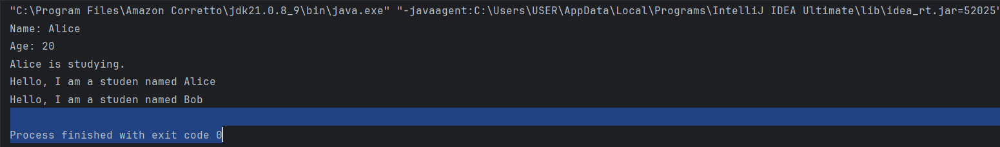
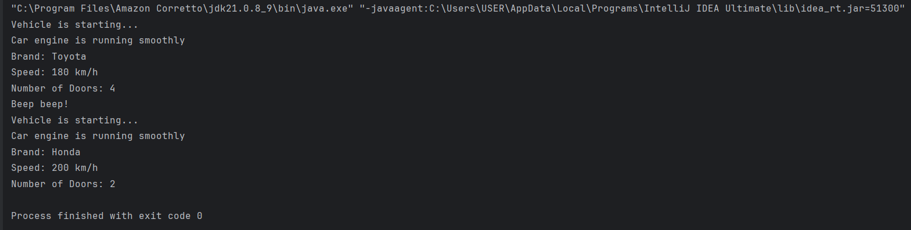
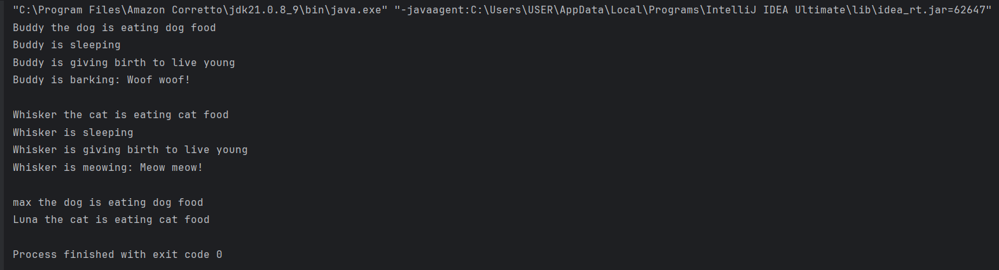
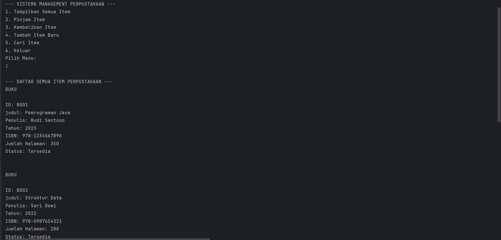
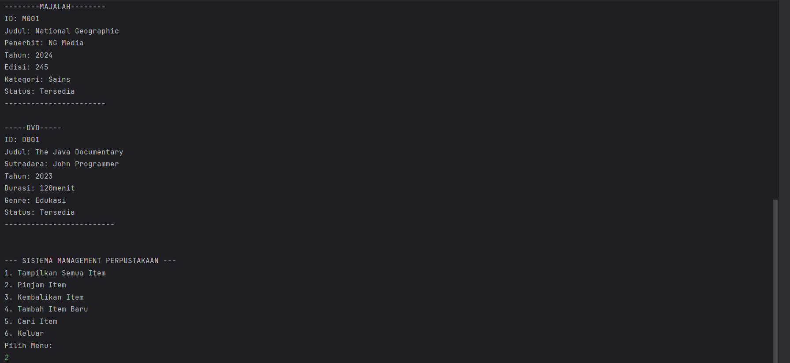
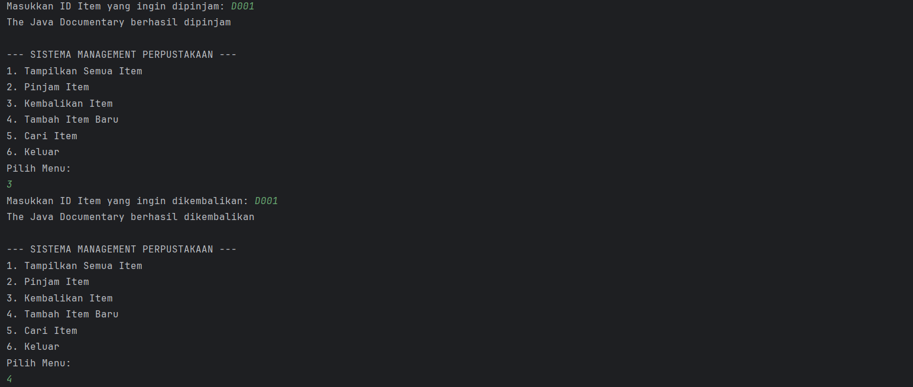
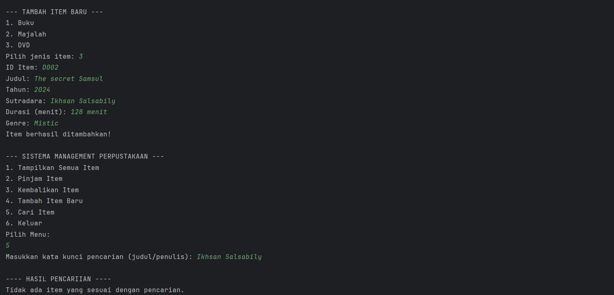
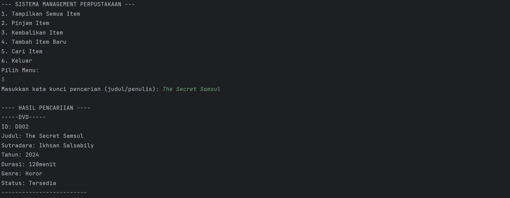
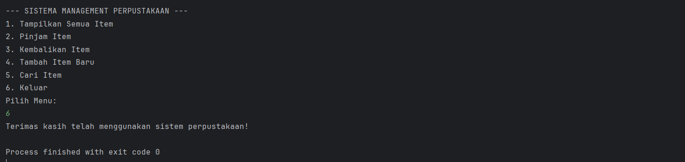

# Laporan Modul 6: Inheritance 

**Mata Kuliah:** Praktikum Pemrograman Berorientasi Objek   
**Nama:** Ikhsan Salsabily  
**NIM:** 2024573010102  
**Kelas:** TI 2E

---

## 1. Abstrak

Laporan ini merangkum hasil praktikum Modul 6 Inheritance.
Tujuannya adalah untuk memahami dan mengimplementasikan konsep-konsep dasar dari inheritance dalam membuat superclass dan subclass

---

## 2. Pendahuluan

Inheritance (Pewarisan) adalah salah satu prinsip fundamental dalam Object-Oriented Programming (OOP) yang memungkinkan sebuah class (subclass/child class) mewarisi sifat dan perilaku dari class lain (superclass/parent class). Dengan inheritance, kita dapat menghindari duplikasi kode dan meningkatkan reusability.

### Tujuan Inheritance :
1. Code Reusability - Menggunakan kembali kode yang sudah ada tanpa menulis ulang.
2. Method Overriding - Memungkinkan subclass mengimplementasikan ulang method dari parent class.
3. Polymorphism - Memungkinkan objek subclass diperlakukan sebagai objek superclass.
4. Extensibility - Memperluas fungsionalitas class yang sudah ada.
5. Hierarchical Classification - Membuat hubungan hierarki antar class.

### Cara Implementasi :
1. Gunakan kata kunci extends untuk mewarisi dari sebuah class.
2. Subclass dapat mengakses anggota (fields dan methods) yang bersifat protected dan public dari superclass.
3. Subclass dapat mengoverride method dari superclass.
4. Gunakan kata kunci super untuk mengakses anggota superclass.

---

## 3. Praktikum

### Praktikum 1 - Memahami Single Inheritance

#### Dasar Teori

Access modifier menentukan tingkat akses terhadap class, attributes, dan methods. Java memiliki 4 jenis access modifier:
1. public
2. protected
3. default
4. private

#### Langkah Praktikum

1. Buat sebuah package baru di dalam package modul_6 dengan nama praktikum_1
2. Buat class Person sebagai superclass
3. Buat class Student sebagai subclass yang mewarisi Person
4. Buat class InheritanceTest untuk testing
5. Jalankan program dan amati hasilnya
6. Perhatikan bagaimana subclass mewarisi dan memperluas fungsionalitas superclass

#### Code Program dan Screenshoot Hasil

1.Class Person
```java
package modul_6.praktikum_1;

public class Person {
    protected String name;
    protected int age;

    public Person(String name, int age) {
        this.name = name;
        this.age = age;
    }
    public void displayinfo() {
        System.out.println("Name: " + this.name);
        System.out.println("Age: " + this.age);
    }

    public void greet() {
        System.out.println("Hello, I am a person.");

    }
}

```

2.Class Student
```java
package modul_6.praktikum_1;

public class Student extends Person {
    private String studentId;

    public Student(String name, int age, String studentId) {
        super(name, age);
        this.studentId = studentId;
    }

    public void study() {
        System.out.println(name + " is studying.");
    }

    @Override
    public void greet() {
        System.out.println("Hello, I am a studen named "+ name);
    }
}

```

3.Class InherritanceTest
```java
package modul_6.praktikum_1;

public class InheritanceTest {
    public static void main(String[] args) {
        Student student = new Student("Alice", 20, "s12345");

        //memanggil method dari superclass
        student.displayinfo();

        //memanggil method dari subclass
        student.study();

        //memanggil overidden method
        student.greet();

        //polymorphism: student sebagai person
        Person person = new Student("Bob", 22, "s67890");
        person.greet(); // memanggil method yang di override
    }
}

```
Output :



#### Analisa dan Pembahasan

Pada program java kali ini kita mencoba membuat sebuah Inheritance yang dimana didalamnya terdapat: Class Person, Class Student dan Class Inheritance.
Class Person dijadikan sebagai Superclass yang mana properti didalamnya akan diwariskan kepada child, kemudian Class Student akan memanggil superclass yang telah ada di Class Person,
kemudian menggunakannya, kemudian pada class InheritanceTest digunakan sebagai main yang akan memanggil semua fungsi yang telah dibuat sebelumnya, dan menampilkan semuanya.


### Praktikum 2 - Method Overriding dan Kata Kunci SUPER

#### Dasar Teori

Method overriding memungkinkan subclass memberikan implementasi spesifik untuk method yang sudah didefinisikan di superclass. Kata kunci super digunakan untuk mengakses anggota superclass.

Aturan Method Overriding :
1. Method harus memiliki nama dan parameter yang sama
2. Return type harus sama atau subtype (covariant return type)
3. Access modifier tidak boleh lebih restriktif
4. Tidak bisa override method yang final atau static

Penggunaan super :
1. super() - Memanggil constructor superclass
2. super.methodName() - Memanggil method superclass
3. super.variableName - Mengakses variable superclass

#### Langkah Praktikum

1. Buat sebuah package baru di dalam package modul_6 dengan nama praktikum_2
2. Buat class Vehicle sebagai superclass
3. Buat class Car sebagai subclass yang mewarisi Vehicle
4. Buat class OverrideTest untuk testing
5. Jalankan program dan amati
- Cara method overriding bekerja
- Penggunaan kata kunci super untuk mengakses superclass
- Konsep polymorphism dalam inheritance

#### Code Program dan Screenshoot Hasil

1.Class Vehicle
```java
package modul_6.Praktikum_2;

public class Vehicle {
    protected String brand;
    protected int speed;

    public Vehicle(String brand, int speed) {
        this.brand = brand;
        this.speed = speed;
    }
    public void start(){
        System.out.println("Vehicle is starting...");
    }
    public void displayInfo(){
        System.out.println("Brand: " + brand);
        System.out.println("Speed: " + speed + " km/h");
    }
}

```

2.Class Car
```java
package modul_6.Praktikum_2;

public class Car extends Vehicle {
    private int numberOfDoors;

    public Car(String brand, int speed, int numberOfDoors){
        super(brand, speed); // memanggil consructor superclass
        this.numberOfDoors = numberOfDoors;
    }

    @Override
    public void start() {
        super.start(); // memanggil method start dari superclass
        System.out.println("Car engine is running smoothly");
    }

    @Override
    public void displayInfo() {
        super.displayInfo(); // memanggil method displayInfo dari superclass
        System.out.println("Number of Doors: " + numberOfDoors);
    }

    public void honk(){
        System.out.println("Beep beep!");
    }
}

```

3.Class OverrideTest
```java
package modul_6.Praktikum_2;

public class OverrideTest {
    public static void main(String[] args) {
        Car car = new Car("Toyota", 180, 4);

        // Memanggil overridden method
        car.start();
        car.displayInfo();
        car.honk();

        //Demonstrasi polymorphism
        Vehicle vehicle = new Car("Honda", 200, 2);
        vehicle.start(); // Memanggil method yang di-override
        vehicle.displayInfo();// memanggil method yang di-override
    }
}

```

Output:

#### Analisa dan Pembahasan

pada program ini kita membuat superclass dan subclass yang mana didalamnya akan menggunakan method yang dioverride, setelah menjalankan program ini
kita bisa mengetahui cara kerja dari sebuah method override, ketika ingin memanggil method yang dioverride maka kita harus menggunakan nama class terlebih dahulu, nama class
yang digunakan harus sesuai dengan tempat method overridenya.

### Praktikum 3 - Multilevel dan Hierarchical Inheritance

#### Langkah Praktikum

1. Buat sebuah package baru di dalam package modul_6 dengan nama praktikum_3
2. Buat class Animal sebagai superclass
3. Buat class Mammal yang mewarisi Animal (multilevel inheritance)
4. Buat class Dog yang mewarisi Mammal (multilevel inheritance)
5. Buat class Cat yang mewarisi Mammal (hierarchical inheritance)
6. Buat class InheritanceTypeTest untuk testing
7. Jalankan program dan amati:
- Cara multilevel inheritance membentuk rantai pewarisan.
- Cara hierarchical inheritance memungkinkan multiple class mewarisi dari satu superclass.
- Polymorphism bekerja dengan inheritance hierarchy.


#### Code Program dan Screenshoot Hasil

1.Class Animal
```java
package modul_6.praktikum_3;

public class Animal {
    protected  String name;

    public Animal(String name) {
        this.name = name;
    }

    public void eat() {
        System.out.println(name+" is eating");
    }

    public void sleep() {
        System.out.println(name+" is sleeping");
    }
}

```

2.Class Mammal
```java
package modul_6.praktikum_3;

public class Mammal extends Animal {
    protected  String furColor;

    public Mammal(String name, String furColor) {
        super(name);
        this.furColor = furColor;
    }

    public void giveBirth(){
        System.out.println(name+" is giving birth to live young");
    }
}

```

3.Class Dog
```java
package modul_6.praktikum_3;

public class Dog extends Mammal{
    private String breed;
    public Dog(String name, String furColor , String breed){
        super(name,furColor);
        this.breed = breed;
    }

    public void bark(){
        System.out.println(name+" is barking: Woof woof!");
    }

    @Override
    public void eat() {
        System.out.println(name+" the dog is eating dog food");
    }
}

```

4.Class Cat
```java
package modul_6.praktikum_3;

public class Cat extends Mammal{
    private boolean isIndoor;

    public Cat(String name, String furColor, boolean isIndoor) {
        super(name,furColor);
        this.isIndoor = isIndoor;
    }

    public void meow(){
        System.out.println(name+" is meowing: Meow meow!");
    }

    @Override
    public void eat() {
        System.out.println(name+" the cat is eating cat food");
    }
}

```

5.Class Inheritance
```java
package modul_6.praktikum_3;

public class InheritanceTest {
    public static void main(String[] args) {
        //Multilevel inheritance test

        Dog dog = new Dog("Buddy", "Brown", "Golden Retriever");
        dog.eat();
        dog.sleep();
        dog.giveBirth();
        dog.bark();

        System.out.println();

        //Hierarchical Inheritance test

        Cat cat = new Cat("Whisker", "White", true);
        cat.eat();
        cat.sleep();
        cat.giveBirth();
        cat.meow();

        System.out.println();

        //Polymorphism dengan hierarchical inheritance
        Animal[] animals = {new Dog("max", "Black" , "Labrador"),
                           new Cat("Luna", "Gray", false)};

        for (Animal animal : animals) {
            animal.eat(); // akan memanggil method yang sesuai dengan objek sebenarnya
        }

    }
}

```
Output:


#### Analisa dan Pembahasan

Pada praktikum kali kita membuat sebuah program multilevel Inheritance, kita membuat class animal yang akan dijadikan superclass, kemudian kita membuat sebuah class baru 
lagi yaitu class Mammal yang didalamnya mewarisi properti dari superclass, setelah kita kita membuat  class dog dan class cat yang mana kedua class ini mewarisi
properti dari class mammal dan class animal.dari program ini kita dapat melihat sebuah sederhana program yang menggunakan multilevel inheritance

---

### Praktikum 4 - Sistem Manajemen Perpustakaan Sederhana

##### Deskripsi Project
Kita akan membuat sistem manajemen perpustakaan sederhana yang memiliki berbagai jenis item (buku, majalah, DVD) dengan karakteristik yang berbeda namun memiliki beberapa kesamaan.


#### Langkah Praktikum
1. Buat sebuah package baru di dalam package modul_6 dengan nama praktikum_4
2. Buat class LibraryItem sebagai superclass
3. Buat class Book yang mewarisi LibraryItem
4. Buat class Magazine yang mewarisi LibraryItem
5. Buat class DVD yang mewarisi LibraryItem
6. Buat class LibraryManagementSystem sebagai main class
7. Jalankan program dan uji semua fitur:
- Menampilkan semua item
- Meminjam dan mengembalikan item
- Menambah item baru
- Mencari item berdasarkan kata kunci
- 
#### Code Program dan Screenshoot Hasil

1.Class LibraryItem

```java
package modul_6.praktikum_4;

public abstract class  LibraryItem {
    protected String itemId;
    protected String title;
    protected int year;
    protected boolean isAvailable;

    public LibraryItem(String itemId, String title, int year) {
        this.itemId = itemId;
        this.title = title;
        this.year = year;
        this.isAvailable = true;
    }

    // Getter Methods
    public String getItemId() { return itemId; }
    public String getTitle() { return title; }
    public int getYear() { return year; }
    public boolean isAvailable() { return isAvailable; }

    // Setter methods
    public void setAvailable(boolean isAvailable) { this.isAvailable = isAvailable; }

    // Abstract method yg harus diimplementasikan subclass
    public abstract void displayInfo();

    // Concrete method yg bisa digunakan semua subclass
    public void  borrowItem() {
        if (isAvailable) {
            isAvailable = false;
            System.out.println(title + " berhasil dipinjam");
        } else {
            System.out.println(title + " sedang tidak tersedia");
        }
    }

    public void returnItem() {
        isAvailable = true;
        System.out.println(title + " berhasil dikembalikan");
    }
}

```

2.Class Book
```java
package modul_6.praktikum_4;

public class Book extends LibraryItem {
    private String author;
    private String isbn;
    private int numberOfPages;

    public Book(String itemId, String title, int year, String author, String isbn, int numberOfPages) {
        super(itemId, title, year);
        this.author = author;
        this.isbn = isbn;
        this.numberOfPages = numberOfPages;
    }

    @Override
    public void displayInfo() {
        System.out.println("BUKU");
        System.out.println("");
        System.out.println("ID: " + itemId);
        System.out.println("judul: " + title);
        System.out.println("Penulis: " + author);
        System.out.println("Tahun: " + year);
        System.out.println("ISBN: " + isbn);
        System.out.println("Jumlah Halaman: " + numberOfPages);
        System.out.println("Status: " + (isAvailable ? "Tersedia" : "Dipinjam"));
        System.out.println("");
    }

    // Method khusus Book
    public void readSample() {
        System.out.println("Membaca sample dari buku: " +title);
    }
}

```

3.Class Magazine
```java
package modul_6.praktikum_4;

public class Magazine extends LibraryItem {
    private String publisher;
    private int issueNumber;
    private String category;

    public Magazine(String itemId, String title, int year, String publisher, int issueNumber, String category) {
        super(itemId, title, year);
        this.publisher = publisher;
        this.issueNumber = issueNumber;
        this.category = category;
    }

    @Override
    public void displayInfo() {
        System.out.println("--------MAJALAH--------");
        System.out.println("ID: " + itemId);
        System.out.println("Judul: " + title);
        System.out.println("Penerbit: " + publisher);
        System.out.println("Tahun: " + year);
        System.out.println("Edisi: " + issueNumber);
        System.out.println("Kategori: " + category);
        System.out.println("Status: " + (isAvailable ? "Tersedia" : "Dipinjam"));
        System.out.println("-----------------------");
    }

    // Method khusus Magazine
    public void browseArticles() {
        System.out.println("Menelusuri artikel dalam majalah: " +title);
}
}

```

4.Class DVD
```java
package modul_6.praktikum_4;

public class DVD extends LibraryItem {
    private String director;
    private int duration;
    private String genre;

    public DVD(String itemId, String title, int year, String director, int duration, String genre) {
        super(itemId, title, year);
        this.director = director;
        this.duration = duration;
        this.genre = genre;
    }

    @Override
    public void displayInfo() {
        System.out.println("-----DVD-----");
        System.out.println("ID: " + itemId);
        System.out.println("Judul: " + title);
        System.out.println("Sutradara: " + director);
        System.out.println("Tahun: " + year);
        System.out.println("Durasi: "  + duration + "menit");
        System.out.println("Genre: " + genre);
        System.out.println("Status: " + (isAvailable ? "Tersedia" : "Dipinjam"));
        System.out.println("-------------------------");
    }

    // Method khusus DVD
    public void playTrailer() {
        System.out.println("Memutar trailer DVD: " +title);
    }
}

```

5.LibraryManagementSystem
```java
package modul_6.praktikum_4;

import java.util.ArrayList;
import java.util.Scanner;

public class LibraryManagementSystem {
    private static ArrayList<LibraryItem> libraryItems =  new ArrayList<>();
    private static Scanner scanner = new Scanner(System.in);

    public static void main(String[] args) {
        initializeSampleData();

        while (true) {
            displayMenu();
            int choice = scanner.nextInt();
            scanner.nextLine(); // coonsume newline

            switch (choice) {
                case 1:
                    displayAllItems();
                    break;
                case 2:
                    borrowItem();
                    break;
                case 3:
                    returnItem();
                    break;
                case 4:
                    addNewItem();
                    break;
                case 5:
                    searchItem();
                    break;
                case 6:
                    System.out.println("Terimas kasih telah menggunakan sistem perpustakaan!");
                    return;
                default:
                    System.out.println("Pilihan tidak valid!");
            }
        }
    }

    private static void displayMenu() {
        System.out.println("\n--- SISTEMA MANAGEMENT PERPUSTAKAAN ---");
        System.out.println("1. Tampilkan Semua Item");
        System.out.println("2. Pinjam Item");
        System.out.println("3. Kembalikan Item");
        System.out.println("4. Tambah Item Baru");
        System.out.println("5. Cari Item");
        System.out.println("6. Keluar");
        System.out.println("Pilih Menu: ");
    }

    private static void initializeSampleData() {
        // Tambahkan sample data
        libraryItems.add(new Book("B001", "Pemrograman Java", 2023, "Budi Santoso", "978-1234567890", 350));
        libraryItems.add(new Book("B002", "Struktur Data", 2022, "Sari Dewi", "978-0987654321", 280));
        libraryItems.add(new Magazine("M001", "National Geographic", 2024, "NG Media", 245, "Sains"));
        libraryItems.add(new DVD("D001", "The Java Documentary", 2023, "John Programmer", 120, "Edukasi"));
    }

    private static void displayAllItems() {
        System.out.println("\n--- DAFTAR SEMUA ITEM PERPUSTAKAAN ---");
        for (LibraryItem item : libraryItems) {
            item.displayInfo();
            System.out.println();
        }
    }

    private static void borrowItem() {
        System.out.print("Masukkan ID Item yang ingin dipinjam: ");
        String itemId = scanner.nextLine();

        for (LibraryItem item : libraryItems) {
            if (item.getItemId().equalsIgnoreCase(itemId)) {
                item.borrowItem();
                return;
            }
        }
        System.out.println("Item dengan ID " + itemId + " tidak ditemukan!");
    }

    private static void returnItem() {
        System.out.print("Masukkan ID Item yang ingin dikembalikan: ");
        String itemId = scanner.nextLine();

        for (LibraryItem item : libraryItems) {
            if (item.getItemId().equalsIgnoreCase(itemId)) {
                item.returnItem();
                return;
            }
        }
        System.out.println("Item dengan ID " + itemId + " tidak ditemukan!");
    }

    private static void addNewItem() {
        System.out.println("\n--- TAMBAH ITEM BARU ---");
        System.out.println("1. Buku");
        System.out.println("2. Majalah");
        System.out.println("3. DVD");
        System.out.print("Pilih jenis item: ");
        int type = scanner.nextInt();
        scanner.nextLine();

        System.out.print("ID Item: ");
        String itemId = scanner.nextLine();
        System.out.print("Judul: ");
        String title = scanner.nextLine();
        System.out.print("Tahun: ");
        int year = scanner.nextInt();
        scanner.nextLine();

        switch (type) {
            case 1:
                System.out.print("Penulis: ");
                String author = scanner.nextLine();
                System.out.print("ISBN: ");
                String isbn = scanner.nextLine();
                System.out.print("Jumlah Halaman: ");
                int pages = scanner.nextInt();
                libraryItems.add(new Book(itemId, title, year, author, isbn, pages));
                break;
            case 2:
                System.out.print("Penerbit: ");
                String publisher = scanner.nextLine();
                System.out.print("Edisi: ");
                int issue = scanner.nextInt();
                scanner.nextLine();
                System.out.print("Kategori: ");
                String category = scanner.nextLine();
                libraryItems.add(new Magazine(itemId, title, year, publisher, issue, category));
                break;
            case 3:
                System.out.print("Sutradara: ");
                String director = scanner.nextLine();
                System.out.print("Durasi (menit): ");
                int duration = scanner.nextInt();
                scanner.nextLine();
                System.out.print("Genre: ");
                String genre = scanner.nextLine();
                libraryItems.add(new DVD(itemId, title, year, director, duration, genre));
                break;
            default:
                System.out.println("Jenis item tidak valid!");
                break;
        }
        System.out.println("Item berhasil ditambahkan!");
    }

    private static void searchItem() {
        System.out.print("Masukkan kata kunci pencarian (judul/penulis): ");
        String keyword = scanner.nextLine().toLowerCase();

        System.out.println("\n---- HASIL PENCARIIAN ----");
        boolean found = false;

        for (LibraryItem item : libraryItems) {
            if (item.getTitle().toLowerCase().contains(keyword)) {
                item.displayInfo();
                System.out.println();
                found = true;
            }
        }

        if (!found) {
            System.out.println("Tidak ada item yang sesuai dengan pencarian.");
        }
    }
}

```

Output:







#### Analisa dan Pembahasan

LibraryItem menjadi cetakan awal bagi semua class perpustakaan, berisi atribut umum (itemId, title, year, isAvailable) dan metode dasar (borrowItem, returnItem) dengan satu metode abstrak displayInfo().
class Book, DVD, dan Magazine masing-masing menambahkan atribut baru(seperti author, director, atau publisher) dan meng-override displayInfo() untuk menampilkan informasi sesuai jenisnya.
LibraryManagementSystem berperan sebagai aplikasi utama yang memanfaatkan polimorfisme, menyimpan semua objek turunan dalam satu ArrayList<LibraryItem> dan dapat menampilkannya sesuai dengan keinginan pengguna.

---

## 3. Kesimpulan

Praktikum ini memberikan pemahaman tentang bagaimana Inheritance bekerja, mulai dari bagaimana sebuah superclass dibuat kemudian bagaimana subclass
memanggil properti yang ada disuperclass, kemudian pada pratikum ini juga kita membuat sebuah program perpustakaan sederhana yang didalamnya 
mengimplementasikan Inheritance

---

## 5. Referensi

Java Tutorials - The Java™ Tutorials - https://docs.oracle.com/javase/tutorial/

Java Data Types - https://www.geeksforgeeks.org/java/java-data-types/

Java Control Flow Statements - https://dev.java/learn/language-basics/controlling-flow/

---
