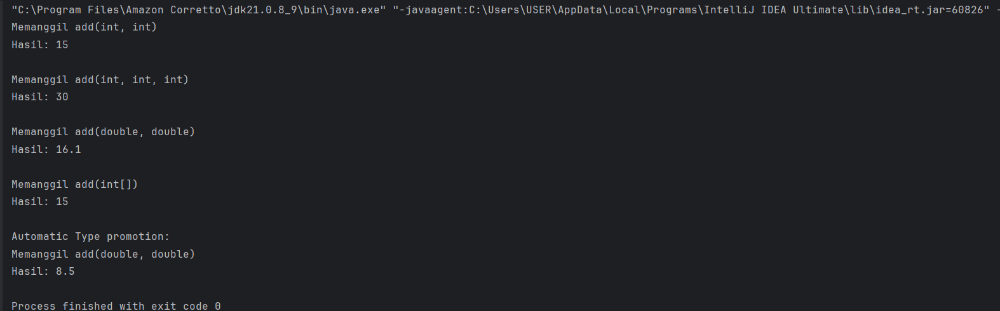
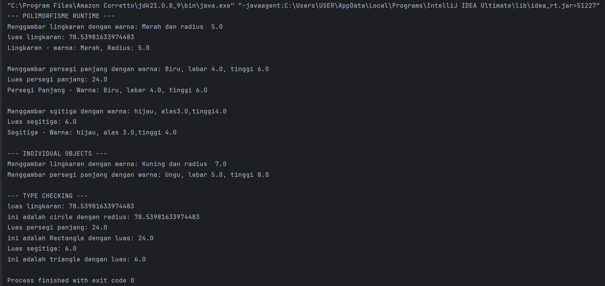

# Laporan Modul 7: Polymorphism

**Mata Kuliah:** Praktikum Pemrograman Berorientasi Objek   
**Nama:** Ikhsan Salsabily  
**NIM:** 2024573010102  
**Kelas:** TI 2E

---

## 1. Abstrak

Laporan ini merangkum hasil praktikum Modul 7 Polymorphism.
Tujuannya adalah untuk memahami dan mengimplementasikan konsep-konsep dasar dari polymorphism dalam membuat sebuah program baik program sederhana maupun program nyata.
laporan ini juga berisi langkah-langkah dan hasil dari percobaan yang dilakukan.

---

## 2. Pendahuluan

Dalam konteks pemrograman OOP (Object Oriented Programming), istilah polymorphism sering digunakan karena berkaitan erat dengan salah satu pilar seperti class,
object, method, atau inheritance. Polymorphism adalah banyak bentuk atau bermacam-macam. Dalam istilah pemrograman, 
polymorphism adalah sebuah konsep di mana sebuah interface tunggal digunakan pada entitas yang berbeda-beda. Umumnya, penggunaan suatu simbol tunggal berfungsi untuk mewakili beberapa jenis tipe entitas.

Polymorphism adalah konsep pemrograman yang berorientasi pada objek yang mengacu pada kemampuan variabel, fungsi atau objek untuk mengambil beberapa bentuk.
Polymorphism adalah penggunaan salah satu item seperti fungsi, atribut, atau interface pada berbagai jenis objek yang berbeda dalam bahasa pemrograman.
Dalam bahasa pemrograman yang menunjukkan polimorfisme, objek kelas miliki hierarki yang sama yang diwariskan dari kelas induk yang sama, mungkin memiliki fungsi dengan nama yang sama, tetapi dengan perilaku berbeda.

### Tujuan Inheritance :
1. Flexibility - Memungkinkan kode yang lebih fleksibel dan mudah diperluas.
2. Code Reusability - Mengurangi duplikasi kode dengan menggunakan interface yang sama.
3. Maintainability - Memudahkan maintenance dan pengembangan fitur baru.
4. Dynamic Behavior - Perilaku objek ditentukan pada runtime
5. Interface Consistency - Konsistensi dalam penggunaan interface

### Cara Implementasi :
1. Gunakan inheritance hierarchy
2. Override method di subclass
3. Gunakan reference superclass untuk memegang objek subclass
4. Method yang dipanggil ditentukan pada runtime berdasarkan tipe aktual objek

---

## 3. Praktikum

### Praktikum 1 - Memahami Method Overloading (Compile-time Polymorphism)

#### Dasar Teori
Method overloading terjadi pada sebuah class yang memiliki nama method yang sama tapi memiliki parameter dan tipe data yang berbeda.
Kata kunci yang perlu kamu ingat:
“Dalam satu class”
“Nama method sama”
“Tipe data dan parameter beda”

Itulah method Overloading.
Contohnya gimana?
Contohnya misalkan kita memiliki class Lingkaran.java. Pada class ini terdapat method luas().
Nah, si method luas() ini bisa saja memiliki parameter yang berbeda.
Misalnya kita ingin menghitung luas berdasarkan jari-jari (radius) atau diameter.

### Aturan Method Overloading
- Nama method harus sama dengan method lainnya.
- Parameter haruslah berbeda.
- Return boleh sama, juga boleh berbeda.

#### Langkah Praktikum

1. Buat sebuah package baru di dalam package modul_7 dengan nama praktikum_1
2. Buat class Calculator dengan method overloading
3. Buat class OverloadingTest untuk testing
4. Jalankan program dan amati hasilnya
5. Perhatikan bagaimana compiler memilih method yang tepat berdasarkan parameter

#### Code Program dan Screenshoot Hasil

1.Class Calculator
```java
package modul_7.praktikum_1;

public class Calculator {

    // Method untuk mejumlahkan dua integer
    public int add(int a, int b) {
        System.out.println("Memanggil add(int, int)");
        return a + b;
    }

    public int add(int a, int b, int c) {
        System.out.println("Memanggil add(int, int, int)");
        return a + b + c;
    }

    public double add(double a, double b) {
        System.out.println("Memanggil add(double, double)");
        return a + b;
    }

    //Overload method untuk menjumlahkan array integer
    public int add(int[] numbers) {
        System.out.println("Memanggil add(int[])");
        int sum = 0;
        for (int num : numbers) {
            sum += num;
        }
        return sum;
    }

    //Overload method untuk concatenate strings
    public String add(String a, String b) {
        System.out.println("Memanggil add(String a, String b)");
        return a + b;
    }

}

```

2.Class OverloadingTest
```java
package modul_7.praktikum_1;

public class OverloadingTest {
    public static void main(String[] args) {
        Calculator calculator = new Calculator();

        // test berbagai versi method add
        System.out.println("Hasil: " + calculator.add(5, 10));
        System.out.println();

        System.out.println("Hasil: " + calculator.add(5, 10, 15));
        System.out.println();

        System.out.println("Hasil: " + calculator.add(5.4, 10.7));
        System.out.println();

        int[] numbers = {1, 2, 3, 4, 5};
        System.out.println("Hasil: " + calculator.add(numbers));
        System.out.println();

        System.out.println("Automatic Type promotion: ");
        System.out.println("Hasil: " + calculator.add(5, 3.5));
    }
}

```

Output :



#### Analisa dan Pembahasan

Pada program java kali ini kita mencoba membuat sebuah  polymorphisme untuk memahami konsep overloading. Pada program kali 
sesuai dengan modul kita membuat sebuah calculator sederhana dimana didalamnya diterapkan konsep overloading, dari sini kita dapat 
melihat dengan jelas bagaimana method overloading bekerja mulai dari nama method yang sama, paramater yang berbeda.semua ini menjelaskan
bagaimana konsep overloading.

### Praktikum 2 - Memahami Method Overriding (Runtime Polymorphism)

#### Dasar Teori

Method overriding memungkinkan subclass memberikan implementasi spesifik untuk method yang sudah didefinisikan di superclass. Kata kunci super digunakan untuk mengakses anggota superclass.

Aturan Method Overriding :
1. Method harus memiliki nama dan parameter yang sama
2. Return type harus sama atau subtype (covariant return type)
3. Access modifier tidak boleh lebih restriktif
4. Tidak bisa override method yang final atau static

Penggunaan super :
1. super() - Memanggil constructor superclass
2. super.methodName() - Memanggil method superclass
3. super.variableName - Mengakses variable superclass

#### Langkah Praktikum

1. Buat sebuah package baru di dalam package modul_7 dengan nama praktikum_2
2. Buat class Shape sebagai superclass
3. Buat class Circle yang mewarisi Shape
4. Buat class Rectangle yang mewarisi Shape
5. Buat class Triangle yang mewarisi Shape
6. Buat class PolymorphismTest untuk testing
7. Jalankan program dan amati:
- Bagaimana method yang dipanggil ditentukan pada runtime
- Perilaku polimorfik dari objek-objek berbeda
- Penggunaan instanceof untuk type checking

#### Code Program dan Screenshoot Hasil

1.Class Shape
```java
package modul_7.praktikum_2;

public class Shape {
    protected String color;

    public Shape(String color) {
        this.color = color;
    }

    public void draw() {
        System.out.println("Menggambar shape dengan warna: " + color);
    }

    public double calculateArea() {
        System.out.println("menghitung luas shape umum");
        return 0.0;
    }

    public void displayInfo() {
        System.out.println("Shape - Warna: " + color);
    }
}

```

2.Class Circle
```java
package modul_7.praktikum_2;

public class Circle extends Shape {
    private double radius;

    public Circle(String color, double radius) {
        super(color);
        this.radius = radius;
    }

    public void draw() {
        System.out.println("Menggambar lingkaran dengan warna: " + color + " dan radius  " + radius);
    }

    public double calculateArea() {
        double area = Math.PI * radius * radius;
        System.out.println("luas lingkaran: " + area);
        return area;
    }

    @Override
    public void displayInfo() {
        System.out.println("Lingkaran - warna: " + color + ", Radius: " + radius);
    }
}

```
3.Class Rectangle
```java
package modul_7.praktikum_2;

public class Rectangle extends Shape {
    private double width;
    private double height;

    public Rectangle(String color, double width, double height) {
        super(color);
        this.width = width;
        this.height = height;
    }

    public void draw(){
        System.out.println("Menggambar persegi panjang dengan warna: "+ color + ", lebar " + width + ", tinggi " + height);
    }

    @Override
    public double calculateArea() {
        double area = width * height;
        System.out.println("Luas persegi panjang: " + area);
        return area;
    }

    @Override
    public void displayInfo() {
        System.out.println("Persegi Panjang - Warna: " + color + ", lebar " + width + ", tinggi " + height);
    }
}

```
4.Class Triangle
```java
package modul_7.praktikum_2;

public class Triangle extends Shape {
    private double base;
    private double height;

    public Triangle(String color, double base, double height) {
        super(color);
        this.base = base;
        this.height = height;
    }

    @Override
    public void draw() {
        System.out.println("Menggambar sgitiga dengan warna: " + color +", alas" + base + ",tinggi" + height);
    }

    @Override
    public double calculateArea() {
        double area = 0.5 * base * height;
        System.out.println("Luas segitiga: " + area);
        return area;
    }

    @Override
    public void displayInfo() {
        System.out.println("Segitiga - Warna: " + color + ", alas " + base + ",tinggi " + height);
    }
}

```
5.Class PolymorphismTest
```java
package modul_7.praktikum_2;

public class PolymorphismTest {
    public static void main(String[] args) {

        //demontrasi runtime polymorphism

        Shape[] shapes = new Shape[3];
        shapes[0] = new Circle("Merah",5.0);
        shapes[1] = new Rectangle("Biru", 4.0, 6.0);
        shapes[2] = new Triangle("hijau", 3.0, 4.0);

        System.out.println("--- POLIMORFISME RUNTIME ---");
        for (Shape shape : shapes) {
            shape.draw();
            shape.calculateArea();
            shape.displayInfo();
            System.out.println();

        }

        // demonstrasi dengan individual object
        System.out.println("--- INDIVIDUAL OBJECTS ---");
        Shape shape1 = new Circle("Kuning",7.0);
        Shape shape2 = new Rectangle("Ungu", 5.0, 8.0);
        shape1.draw();
        shape2.draw();

        //type casting dan instanceof
        System.out.println("\n--- TYPE CHECKING ---");
        for (Shape shape : shapes) {
            if (shape instanceof Circle) {
                Circle circle = (Circle) shape;
                System.out.println("ini adalah circle dengan radius: " + circle.calculateArea());
            } else if (shape instanceof Rectangle) {
                Rectangle rectangle = (Rectangle) shape;
                System.out.println("ini adalah Rectangle dengan luas: " + rectangle.calculateArea());
            }else if (shape instanceof Triangle) {
                Triangle triangle = (Triangle) shape;
                System.out.println("ini adalah triangle dengan luas: " + triangle.calculateArea());
            }
        }
    }
}

```
Output:

#### Analisa dan Pembahasan

pada percobaan program kali ini kita membuat superclass dan subclass untuk memahami bagaimana sebuah method overriding bekerja, disini kita membuat
program sederhana untuk menghitung bangun datar disini kita membuat shape sebagai superclass. Circle, triangle, dan rectangle sebagai subclass,
nah disini subclass mewarisi atribut dan method dari superclass, method yang dipanggil oleh subclass ini kemudian dapat ditambahkan dengan parameter
yang ada disubclass tersebut.

---

## 3. Kesimpulan

Praktikum ini memberikan pemahaman tentang bagaimana Polymorphism bekerja, polymorphism berkaitan erat dengan inheritance karena didalam konsep dari polymorphism itu sendiri
menggunakan inheritance seperti penggunaan super dan pewarisan method, dari pratikum ini kita juga dapat mengetahui perbedaan dari method overloading dan overriding, bagaimana kedua method ini bekerja dan menjadi sebuah output.


---

## 5. Referensi

Java Tutorials - The Java™ Tutorials - https://docs.oracle.com/javase/tutorial/

Java Data Types - https://www.geeksforgeeks.org/java/java-data-types/

Java Control Flow Statements - https://dev.java/learn/language-basics/controlling-flow/

Java Polymorphisme - https://www.petanikode.com/java-oop-polimorfisme/

Java Polymorphisme - https://www.dicoding.com/blog/pengertian-polimorfisme-dalam-pemrograman-java/

---
