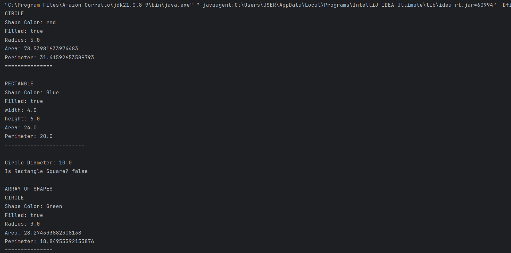
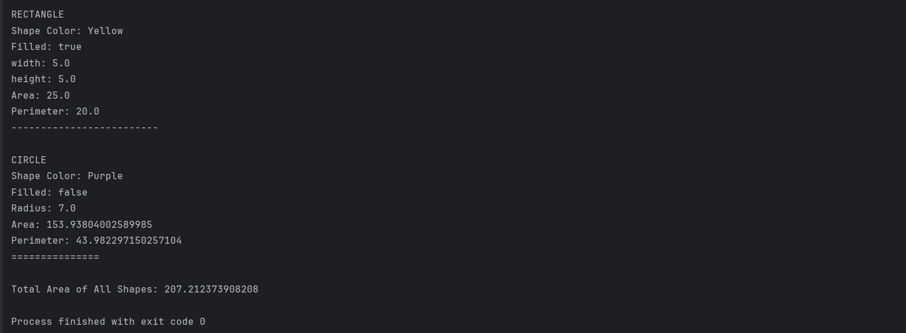
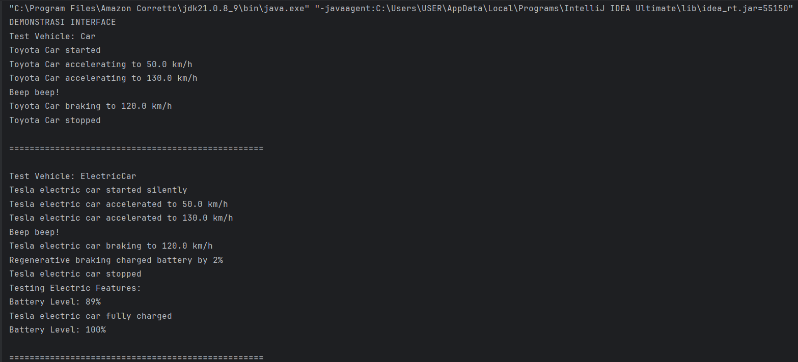
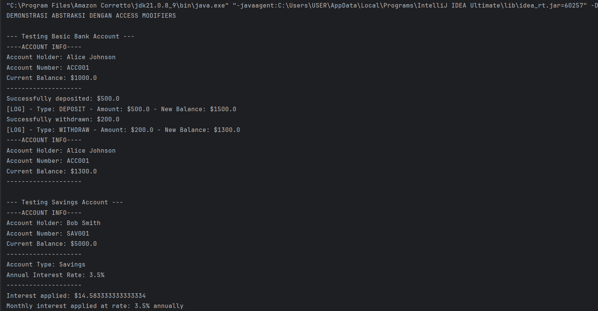
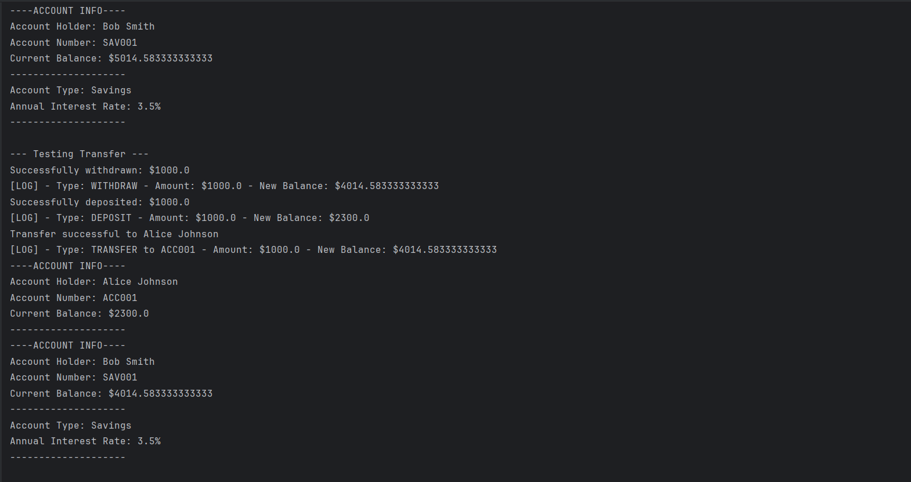
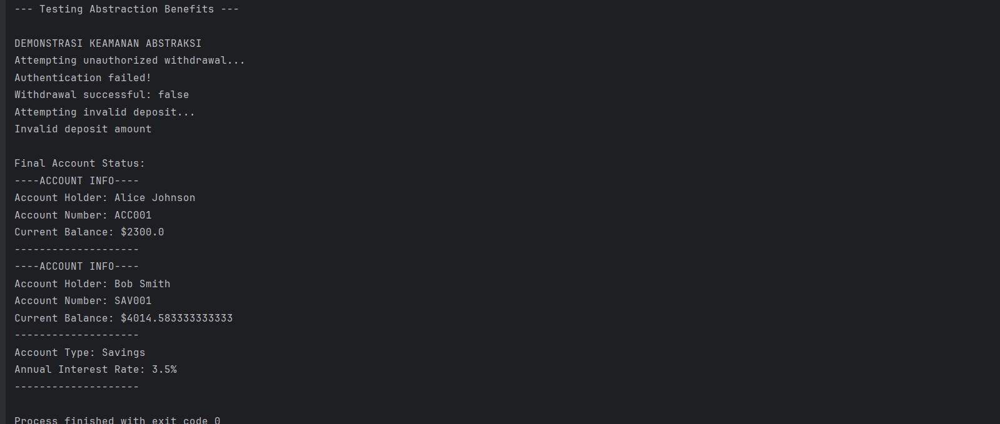

# Laporan Modul 8: Abstraction

**Mata Kuliah:** Praktikum Pemrograman Berorientasi Objek   
**Nama:** Ikhsan Salsabily  
**NIM:** 2024573010102  
**Kelas:** TI 2E

---

## 1. Abstrak

Laporan ini merangkum hasil praktikum Modul 8 Abstraction.
Tujuannya adalah untuk memahami dan mengimplementasikan konsep-konsep dasar dari abstraction dalam membuat sebuah program baik program sederhana maupun program nyata.
laporan ini juga berisi langkah-langkah dan hasil dari percobaan yang dilakukan.

---

## 2. Pendahuluan

Abstraksi adalah konsep dalam object-oriented programming (OOP) yang bertujuan untuk menyederhanakan kompleksitas sistem
dengan menyembunyikan detail-detail teknis yang tidak perlu.

Inti dari abstraksi adalah tentang fokus pada 'apa' yang dilakukan suatu objek atau komponen, bukan 'bagaimana' hal itu dilakukan. 
Dalam praktiknya, abstraksi membantu programmer mendefinisikan interface, menunjukkan operasi yang dapat dilakukan oleh suatu objek,
tanpa harus menyertakan detail tentang logika internal atau implementasi di balik operasi tersebut.

Misalnya, ketika menggunakan remote TV, kita hanya perlu tahu cara mengoperasikannya tanpa harus memahami mekanisme internalnya. 
Dalam OOP, objek menyediakan abstraksi yang menyembunyikan detail implementasi internal. Seperti remote TV,
user hanya perlu tahu metode apa dari objek yang tersedia untuk dipanggil dan parameter input apa yang diperlukan untuk memicu operasi tertentu.

Dalam desain software, abstraksi berguna agar sistem dapat dibagi menjadi komponen-komponen yang lebih kecil dan lebih mudah dikelola,
di mana masing-masing menyembunyikan kompleksitasnya sendiri. Hal ini tidak hanya memudahkan proses pengembangan,
tetapi juga memfasilitasi maintenance dan testing software.

Selain itu, abstraksi juga bisa dipakai untuk mengubah implementasi internal suatu komponen tanpa memengaruhi komponen lain 
yang berinteraksi dengan komponen tersebut, asalkan interface yang digunakan tetap konsisten.

### Fungsi Abstraksi :
1. Menyederhanakan kompleksitas: abstraksi membantu dalam menyederhanakan sistem yang kompleks. 
Dengan menyembunyikan detail internal dan menampilkan hanya fungsionalitas yang diperlukan, abstraksi membantu programmer
untuk tidak terbebani oleh kompleksitas yang tidak relevan.
2. Meningkatkan modularitas: abstraksi mendukung pembuatan modul yang dapat digunakan kembali.
Dengan mendefinisikan interface yang jelas, modul dapat dikembangkan secara independen dan digunakan dalam berbagai konteks
tanpa perlu mengetahui detail internalnya.
3. Memudahkan maintenance: kode yang mengimplementasikan abstraksi lebih mudah dipelihara dan diperbarui. Perubahan pada
implementasi internal suatu modul tidak
memengaruhi modul lain yang menggunakan interface abstrak tersebut.
4. Meningkatkan keamanan: dengan menyembunyikan detail internal, abstraksi akan meningkatkan keamanan software.
Hal ini mencegah akses tidak sah ke data internal atau manipulasi fungsi internal.
5. Memfasilitasi kolaborasi: dalam proyek besar dengan banyak developer, abstraksi memungkinkan tim untuk bekerja secara
paralel pada komponen yang berbeda. Setiap tim fokus pada tugasnya sendiri tanpa perlu memahami keseluruhan sistem.
6. Mendukung polimorfisme dan penggunaan ulang kode: abstraksi mendukung penggunaan polimorfisme, di mana objek dari class
berbeda dapat diakses melalui interface yang sama.
Ini meningkatkan fleksibilitas dan penggunaan ulang kode.
7. Mendukung pemisahan antara interface dan implementasi: abstraksi bisa memisahkan apa yang dilakukan suatu objek 
(interface) dan bagaimana hal itu dilakukan (implementasi). Ini memudahkan pemahaman dan pengembangan software.

### Contoh Abstraction :
Contoh dari abstraksi adalah penggunaan aplikasi pengolah kata, seperti Microsoft Word. Microsoft Word adalah aplikasi pengolah kata untuk membuat, mengedit,
dan memformat dokumen teks. Aplikasi ini menyediakan berbagai fitur seperti pengecekan ejaan dan tata bahasa, format teks, penambahan gambar, dan pembuatan tabel.
Beberapa fitur yang ditawarkan Microsoft Word yaitu:
1. Pembuatan dan pengeditan Dokumen
2. Pengecekan ejaan dan tata bahasa
3. Insert object
4. Template dan desain dokumen

### Cara Implementasi :
1. Abstract Classes - Class yang tidak dapat diinstansiasi langsung dan mengandung abstract methods
2. Interfaces - Kontrak yang mendefinisikan method yang harus diimplementasikan
3. Access Modifiers - Menggunakan private/protected untuk menyembunyikan detail implementasi

---

## 3. Praktikum

### Praktikum 1 - Memahami Abstract Class dan Abstract Method

#### Dasar Teori
Abstract Class
Abstract class adalah kelas yang tidak dapat diinstansiasi (tidak bisa dibuat objeknya langsung). Kelas ini berfungsi sebagai kerangka dasar (template) untuk kelas-kelas turunannya.
Ciri-ciri Abstract Class:
1. Dideklarasikan dengan keyword abstract
2. Tidak bisa dibuat objeknya dengan new
3. Dapat memiliki method abstrak dan method konkret (biasa)
4. Dapat memiliki constructor, field, dan method seperti kelas biasa

Abstract Method
Abstract method adalah method yang hanya dideklarasikan tanpa implementasi (tanpa body). Implementasinya wajib diberikan oleh subclass yang mewarisinya.

Ciri-ciri Abstract Method:
1. Hanya deklarasi tanpa body {}
2. Harus berada dalam abstract class
3. Subclass wajib mengoverride method abstrak ini
4. Dideklarasikan dengan keyword abstract

#### Langkah Praktikum
1. Buat sebuah package baru di dalam package modul_8 dengan nama praktikum_1
2. Buat abstract class Shape
3. Buat class Circle yang mewarisi Shape
4. Buat class Rectangle yang mewarisi Shape
5. Buat class AbstractClassTest untuk testing
7. Jalankan program dan amati hasilnya.
8. Coba buat instance abstract class langsung dan lihat error yang terjadi.

#### Code Program dan Screenshoot Hasil

1.Class Shape
```java
package modul_8.praktikum_1;

public abstract class Shape {
    protected String color;
    protected boolean filled;

    //Consttructor
    public Shape(String color, boolean filled) {
        this.color = color;
        this.filled = filled;
    }

    // Abstract methods - harus diimplementasikan subclass
    public abstract double calculateArea();
    public abstract double calculatePerimeter();

    // concrete methods - sudah memiliki implementasi

    public String getColor() {
        return color;
    }
    public void setColor(String color) {
        this.color = color;
    }

    public boolean isFilled() {
        return filled;
    }
    public void setFilled(boolean filled) {
        this.filled = filled;
    }

    public void displayInfo() {
        System.out.println("Shape Color: " + color);
        System.out.println("Filled: " + filled);
    }
}

```

2.Class Circle
```java
package modul_8.praktikum_1;

import java.awt.*;

public class Circle extends Shape {
    private double radius;

    public Circle( String Color, boolean filled, double radius ) {
        super(Color, filled);
        this.radius = radius;
    }

    //implementasi abstract methods


    @Override
    public double calculateArea() {
        return Math.PI * radius * radius;
    }

    @Override
    public double calculatePerimeter() {
        return 2 * Math.PI * radius;
    }

    // override concrete methods
    public void displayInfo() {
        System.out.println("CIRCLE");
        super.displayInfo();
        System.out.println("Radius: " + radius);
        System.out.println("Area: " + calculateArea());
        System.out.println("Perimeter: " + calculatePerimeter());
        System.out.println("===============");
    }

    //method khusus circle
    public double getDiameter() {
        return 2 * radius;
    }
}

```

3.Class Rectangle
```java
package modul_8.praktikum_1;

public class Rectangle extends Shape {
    private double width;
    private double height;

    public Rectangle(String color, boolean filled, double width, double height) {
        super(color,filled);
        this.width = width;
        this.height = height;
    }

    @Override
    public double calculateArea() {
        return width * height;
    }

    @Override
    public double calculatePerimeter() {
        return 2 * (width + height);
    }

    @Override
    public void displayInfo() {
        System.out.println("RECTANGLE");
        super.displayInfo();
        System.out.println("width: " + width);
        System.out.println("height: " + height);
        System.out.println("Area: " + calculateArea());
        System.out.println("Perimeter: " + calculatePerimeter());
        System.out.println("-------------------------");
    }

    public boolean isSquare() {
        return width == height;
    }
}

```

4.Class AbstracClassTest
```java
package modul_8.praktikum_1;

public class AbstractClassTest {
    public static void main(String[] args) {
        // tidak bisa membuat instance abstract class langsung
        // Shape shape = new Shape ("Red", true); // ERROR!!

        //Membuat objects dari concrete subclasses
        Circle circle = new Circle("red", true, 5.0);
        Rectangle rectangle = new Rectangle("Blue", true, 4.0, 6.0);

        //Menggunakan abstract class reference
        Shape shape1 = circle;
        Shape shape2 = rectangle;

        //polymorphic calls
        shape1.displayInfo();
        System.out.println();

        shape2.displayInfo();
        System.out.println();

        //Mengakses method khusus subclass melalui casting
        System.out.println("Circle Diameter: " + circle.getDiameter());
        System.out.println("Is Rectangle Square? " + rectangle.isSquare());

        //Array of shapes - demonstrating polymorphism
        System.out.println("\nARRAY OF SHAPES");
        Shape[] shapes = new Shape[3];
        shapes[0] = new Circle("Green", true, 3.0);
        shapes[1] = new Rectangle("Yellow", true, 5.0, 5.0);
        shapes[2] = new Circle("Purple", false, 7.0);

        double totalArea = 0;
        for (Shape shape : shapes) {
            shape.displayInfo();
            totalArea += shape.calculateArea();// abstract method call
            System.out.println();
        }
        System.out.println("Total Area of All Shapes: " + totalArea);
    }
}

```
Output :




#### Analisa dan Pembahasan

Program ini pakai konsep Shape sebagai cetakan awal yang cuma ngasih atribut dasar,
dan Circle sama Rectangle sebagai program yang menggunakan cetakan itu dengan mengambil atribut tersebut kemudian menambah
isi atribut tersebut sesuai dengan program tersebut. Di bagian AbstractClassTest, semua program yang menggunakan cetakan ini
dikumpulin dalam satu barisan (Shape[]) dan menghitung luas masing-masing, program tidak akan bingung karena pasti sudah mengenalinya isi programnya sesuai dengan aturan yang telah dibuat.

### Praktikum 2 - Memahami Interface

#### Dasar Teori
Interface adalah kontrak yang mendefinisikan method yang harus diimplementasikan oleh class yang menggunakannya.
Interface hanya berisi deklarasi method tanpa implementasi (kecuali default dan static methods di Java 8+).

Karakteristik Interface:
1. Semua method secara default abstract dan public.
2. Semua variables secara default public, static, dan final.
3. Mendukung multiple inheritance.
4. Dapat memiliki default dan static methods.
5. Dapat memiliki private methods.

#### Langkah Praktikum
1. Buat sebuah package baru di dalam package modul_8 dengan nama praktikum_2
2. Buat interface Vehicle
3. Buat interface Electric
4. Buat class Car yang mengimplementasi Vehicle
5. Buat class ElectricCar yang mengimplementasi kedua interface
6. Buat class InterfaceTest untuk testing
7. Jalankan program dan amati:
- Implementasi multiple interface
- Penggunaan default dan static methods
- Perbedaan antara abstract class dan interface

#### Code Program dan Screenshoot Hasil

1.Class Vehicle
```java
package modul_8.praktikum_2;

public interface Vehicle {
    // constant fields (public static final by default)
    int MAX_SPEED = 200;

    //Abstract methods (public abstract by default)
    void start();
    void stop();
    void accelerate(double speed);
    void brake();

    //default method (java 8+)

    default void honk(){
        System.out.println("Beep beep!");
    }

    static void displayMaxSpeed(){
        System.out.println("Maximun speed for all vehicles: " + MAX_SPEED + "km/h");
    }
}

```

2.Class Electric
```java
package modul_8.praktikum_2;

public interface Electric {
    void charge();
    int getBatteryLevel();
    void setBatteryLevel(int Level);

    default void displayBatteryInfo() {
        System.out.println("Battery Level: " + getBatteryLevel() + "%");
    }
}

```
3.Class Car
```java
package modul_8.praktikum_2;

public class Car implements Vehicle {
    private String brand;
    private double currentSpeed;
    private boolean isRunning;

    public Car(String brand) {
        this.brand = brand;
        this.currentSpeed = 0;
        this.isRunning = false;
    }

    @Override
    public void start() {
        if (!isRunning) {
            isRunning = true;
            System.out.println(brand + " Car started");
        } else {
            System.out.println(brand + " Car is already running");
        }
    }

    @Override
    public void stop() {
        if (isRunning) {
            isRunning = false;
            currentSpeed = 0;
            System.out.println(brand + " Car stopped");
        } else {
            System.out.println(brand + " Car is already stopped");
        }
    }

    @Override
    public void accelerate(double speed) {
        if (isRunning) {
            currentSpeed += speed;
            if (currentSpeed > MAX_SPEED) {
                currentSpeed = MAX_SPEED;
            }
            System.out.println(brand + " Car accelerating to " + currentSpeed + " km/h");
        } else {
            System.out.println("Please start the car first");
        }
    }

    @Override
    public void brake() {
        if (currentSpeed > 0) {
            currentSpeed -= 10;
            if (currentSpeed < 0) currentSpeed = 0;
            System.out.println(brand + " Car braking to " + currentSpeed + " km/h");
        } else  {
            System.out.println(brand + " Car is already stopped");
        }
    }

    // Getter methods
    public String getBrand() { return brand; }
    public double getCurrentSpeed() { return currentSpeed; }
    public boolean isRunning() { return isRunning; }
}
```
4.Class ElectricCar
```java
package modul_8.praktikum_2;

public class ElectricCar implements Vehicle, Electric {
    private String brand;
    private double currentSpeed;
    private boolean isRunning;
    private int batteryLevel;

    public ElectricCar(String brand) {
        this.brand = brand;
        this.currentSpeed = 0;
        this.isRunning = false;
        this.batteryLevel = 100; // Fully charged
    }

    // Implement Vehicle interface methods
    @Override
    public void start() {
        if (!isRunning && batteryLevel > 0) {
            isRunning = true;
            System.out.println(brand + " electric car started silently");
        } else if (batteryLevel <= 0) {
            System.out.println("Cannot start. Battery is empty. Please charge first.");
        } else {
            System.out.println(brand + " electric car is already running");
        }
    }

    @Override
    public void stop() {
        if (isRunning) {
            isRunning = false;
            currentSpeed = 0;
            System.out.println(brand + " electric car stopped");
        } else {
            System.out.println(brand + " electric car is already stopped");
        }
    }

    @Override
    public void accelerate(double speed) {
        if (isRunning && batteryLevel > 0) {
            currentSpeed += speed;
            batteryLevel -= (int)speed / 10; // Battery consumption
            if (batteryLevel < 0) batteryLevel = 0;
            if (currentSpeed > MAX_SPEED) currentSpeed = MAX_SPEED;
            System.out.println(brand + " electric car accelerated to " +  currentSpeed + " km/h");
        } else if (batteryLevel <= 0) {
            System.out.println("Cannot accelerate. Battery is empty.");
        } else  {
            System.out.println("Please start the car first");
        }
    }

    @Override
    public void brake() {
        if (currentSpeed > 0) {
            currentSpeed -= 10;
            if (currentSpeed < 0) currentSpeed = 0;
            System.out.println(brand + " electric car braking to " +  currentSpeed + " km/h");

            // Regenerative braking - charge battery slightly
            if (batteryLevel < 100) {
                batteryLevel += 2;
                System.out.println("Regenerative braking charged battery by 2%");
            }
        } else {
            System.out.println(brand + " electric car is already stopped");
        }
    }

    // Override default method
    @Override
    public void charge() {
        batteryLevel = 100;
        System.out.println(brand + " electric car fully charged");
    }

    @Override
    public int getBatteryLevel() {
        return batteryLevel;
    }

    @Override
    public void setBatteryLevel(int level) {
        if (level >= 0 && level <= 100) {
            batteryLevel = level;
        } else {
            System.out.println("Battery level must be between 0 and 100");
        }
    }

    // Getter Methods
    public String getBrand() { return brand; }
    public double getCurrentSpeed() { return currentSpeed; }
    public boolean isRunning() { return isRunning; }
}
```
5.Class InterfaceTest
```java
package modul_8.praktikum_2;

public class InterfaceTest {
    public static void main(String[] args) {
        System.out.println("DEMONSTRASI INTERFACE");

        // Test regular car
        Car car = new Car("Toyota");
        testVehicle(car);

        System.out.println("\n" + "=".repeat(50) + "\n");

        // Test electric car
        ElectricCar electricCar = new ElectricCar("Tesla");
        testVehicle(electricCar);
        testElectric(electricCar);

        System.out.println("\n" + "=".repeat(50) + "\n");

        // Demonstrasi multiple interface implementation
        System.out.println("MULTIPLE INTERFACE DEMO");
        electricCar.honk();  // Overridden default method
        electricCar.displayBatteryInfo();  // Default method from Electric interface

        // Static method call
        Vehicle.displayMaxSpeed();

        // Interface constants
        System.out.println("MAX_SPEED constant: " + Vehicle.MAX_SPEED + " km/h");
    }

    public static void testVehicle(Vehicle vehicle) {
        System.out.println("Test Vehicle: " + vehicle.getClass().getSimpleName());
        vehicle.start();
        vehicle.accelerate(50);
        vehicle.accelerate(80);
        vehicle.honk(); // default method
        vehicle.brake();
        vehicle.stop();
    }

    public static void testElectric(Electric electric) {
        System.out.println("Testing Electric Features: ");
        electric.displayBatteryInfo();
        electric.charge();
        electric.displayBatteryInfo();
    }
}
```
Output:


#### Analisa dan Pembahasan

Dari Program ini kita bisa tau bahwa Interface bisa juga disebut sebagai sebuah aturan.
Vehicle itu aturan umum yang harus diikuti oleh semua class yang mewarisinya,
dan Electric itu aturan tambahan bagian Sebagian class(pada program ini class electriccar).
Mobil biasa (Car) hanya megikuti aturan dari vehicle, tapi mobil listrik (ElectricCar) harus ikut kedua aturan ini.
Karena mereka semua mematuhi Vehicle, kedua class ini juga bisa diuji secara bersamaan oleh satu fungsi yang sama dalam 
class Interfacetest(testVehicle), itu bikin kodenya jadi rapi dan fleksibel!"

---

### Praktikum 3 - Abstraksi dengan Access Modifiers

#### Langkah Praktikum
1. Buat sebuah package baru di dalam package modul_8 dengan nama praktikum_3
2. Buat class BankAccount yang mengimplementasi abstraksi
3. Buat class SavingsAccount yang mewarisi BankAccount
4. Buat class AbstractionTest untuk testing
5. Jalankan program dan amati:
- Bagaimana private fields dan methods disembunyikan
- Bagaimana public methods menyediakan interface yang aman
- Manfaat abstraksi dalam keamanan dan encapsulation
- Penggunaan protected methods dalam inheritance
#### Code Program dan Screenshoot Hasil

1.Class BankAccount
```java
package modul_8.praktikum_3;

public class BankAccount {
    // Private fields - hidden from outside world
    private String accountNumber;
    private String accountHolder;
    private double balance;
    private String password;

    // Public constructor
    public BankAccount(String accountNumber, String accountHolder, double initialBalance, String password) {
        this.accountNumber = accountNumber;
        this.accountHolder = accountHolder;
        this.balance = initialBalance;
        this.password = password;
    }

    // Public methods - interface to the outside world
    public double getBalance() {
        return balance;
    }

    public String getAccountNumber() {
        return accountNumber;
    }

    public String getAccountHolder() {
        return accountHolder;
    }

    public void deposit(double amount) {
        if (amount > 0) {
            balance += amount;
            System.out.println("Successfully deposited: $" + amount);
            logTransaction("DEPOSIT", amount);
        } else {
            System.out.println("Invalid deposit amount");
        }
    }

    public boolean withdraw(double amount, String inputPassword) {
        if (authenticate(inputPassword)) {
            if (amount > 0 && amount <= balance) {
                balance -= amount;
                System.out.println("Successfully withdrawn: $" + amount);
                logTransaction("WITHDRAW", amount);
                return true;
            } else {
                System.out.println("Invalid withdrawal amount or insufficient funds");
                return false;
            }
        } else {
            System.out.println("Authentication failed!");
            return false;
        }
    }

    public boolean transfer(BankAccount recipient, double amount, String inputPassword) {
        if (authenticate(inputPassword)) {
            if (withdraw(amount, inputPassword)) {
                recipient.deposit(amount);
                System.out.println("Transfer successful to " + recipient.getAccountHolder());
                logTransaction("TRANSFER to " + recipient.getAccountNumber(), amount);
                return true;
            }
        }
        return false;
    }

    // Private method - hidden implementation detail
    private boolean authenticate(String inputPassword) {
        return this.password.equals(inputPassword);
    }

    // Private method - logging internal state change
    private void logTransaction(String type, double amount) {
        System.out.println("[LOG] - Type: " + type + " - Amount: $" + amount + " - New Balance: $" + balance);
    }

    // Protected method - accessible within package and subclasses
    protected void applyInterest(double rate) {
        double interest = balance * (rate / 100);
        balance += interest;
        System.out.println("Interest applied: $" + interest);
    }

    // Package-private method - to display non-sensitive info
    void displayAccountInfo() {
        System.out.println("----ACCOUNT INFO----");
        System.out.println("Account Holder: " + accountHolder);
        System.out.println("Account Number: " + accountNumber);
        System.out.println("Current Balance: $" + balance);
        System.out.println("--------------------");
    }

}

```

2.Class SavingsAccount
```java
package modul_8.praktikum_3;

public class SavingsAccount extends BankAccount{
    private double interestRate;

    public SavingsAccount(String accountNumber, String accountHolder,
                          double initialBalance, String password, double interestRate) {
        super(accountNumber, accountHolder, initialBalance, password);
        this.interestRate = interestRate;
    }

    // Public method to apply interest
    public void applyMonthlyInterest() { // Calling protected method from parent
        applyInterest(interestRate / 12);
        System.out.println("Monthly interest applied at rate: " + interestRate + "% annually");
    }

    @Override
    public void displayAccountInfo() {
        super.displayAccountInfo();
        System.out.println("Account Type: Savings");
        System.out.println("Annual Interest Rate: " + interestRate + "%");
        System.out.println("--------------------");

    }
}

```
3.Class AbstractionTest
```java
package modul_8.praktikum_3;

public class AbstractionTest {
    public static void main(String[] args) {
        System.out.println("DEMONSTRASI ABSTRAKSI DENGAN ACCESS MODIFIERS");

        // Create accounts
        BankAccount account1 = new BankAccount("ACC001", "Alice Johnson",
                1000.0, "pass123");
        SavingsAccount account2 = new SavingsAccount("SAV001", "Bob Smith",
                5000.0, "save456", 3.5);

        // Test public interface
        System.out.println("\n--- Testing Basic Bank Account ---");
        account1.displayAccountInfo();
        account1.deposit(500.0);
        account1.withdraw(200.0, "pass123");
        account1.displayAccountInfo();

        System.out.println("\n--- Testing Savings Account ---");
        account2.displayAccountInfo();
        account2.applyMonthlyInterest();
        account2.displayAccountInfo();

        System.out.println("\n--- Testing Transfer ---");
        account2.transfer(account1, 1000.0, "save456");
        account1.displayAccountInfo();
        account2.displayAccountInfo();

        System.out.println("\n--- Testing Abstraction Benefits ---");

        // Cannot access private members directly
        // System.out.println(account1.balance); // ERROR - private field
        // System.out.println(account1.password); // ERROR - private field

        // Cannot call private methods
        // account1.authenticate("pass123"); // ERROR - private method
        // account1.logTransaction("TEST", 100); // ERROR - private method

        // Protected method is accessible through public interface in subclass
        // account1.applyInterest(5.0); // ERROR - protected method not accessible outside hierarchy

        System.out.println("\nDEMONSTRASI KEAMANAN ABSTRAKSI");

        // Attempt unauthorized access
        System.out.println("Attempting unauthorized withdrawal...");
        boolean success = account1.withdraw(1000.0, "wrongpassword");
        System.out.println("Withdrawal successful: " + success);

        System.out.println("Attempting invalid deposit...");
        account1.deposit(-100.0); // Invalid amount

        System.out.println("\nFinal Account Status:");
        account1.displayAccountInfo();
        account2.displayAccountInfo();

    }
}

```


Output:



#### Analisa dan Pembahasan

Program bank sederhana ini menggunakan enkapsulasi dan abstraksi untuk membuat sistem perbankan yang aman.

BankAccount berfungsi sebagai tempat Utama yang menyembunyikan data sensitif (balance, password) sebagai private untuk mencegah akses langsung (keamanan data).
Semua interaksi dilakukan melalui method public (seperti deposit dan withdraw), yang bertindak sebagai prosedur resmi.
Proses vital internal, seperti pengecekan sandi (authenticate), disembunyikan sebagai private method agar tidak bisa dipanggil atau dirusak dari luar.
Fitur khusus seperti pemberian bunga (applyInterest) disetel protected, hanya bisa diakses oleh subclass, yaitu SavingsAccount, yang kemudian  bisa menambah fitur tabungan.
Melalui AbstractionTest, terbukti bahwa sistem berhasil menolak upaya penarikan dengan kata sandi salah, menegaskan bahwa abstraksi menjamin integritas dan keamanan data nasabah.

---

## 3. Kesimpulan
pada praktikum 1 kita Membuat program abstractclass yang didalamnya berisi (Shape yang atributnya diwarisi  Circle, Rectangle) yang mewarisi atribut awal dan kemudian dapat mengembangkan atribut tersebut sesuai dengan kebutuhan classnya
paa praktikum ke 2 kita Membuat program yang didalamnya ada "aturan" yang harus dipatuhi (implements) oleh kelas, memungkinkan satu kelas mematuhi banyak aturan (Multiple Inheritance of Type).
pada praktikum ke 3 kita membuat sebuah program bank sederhana yang melindungi data sensitif (private) dan menyembunyikan detail implementasi, hanya menyediakan akses melalui prosedur resmi (public) yang aman. sehingga ouput program lebih sederhana dan aman.
---

## 5. Referensi

Java Tutorials - The Java™ Tutorials - https://docs.oracle.com/javase/tutorial/

Java Data Types - https://www.geeksforgeeks.org/java/java-data-types/

Mengenal Abstract dalam java - https://www.petanikode.com/java-oop-abstract/

Interface dalam java - https://www.petanikode.com/java-oop-interface/

---
